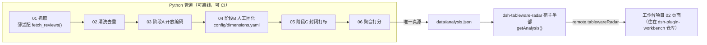
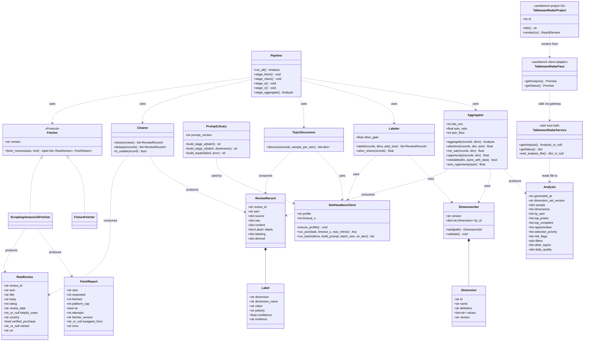
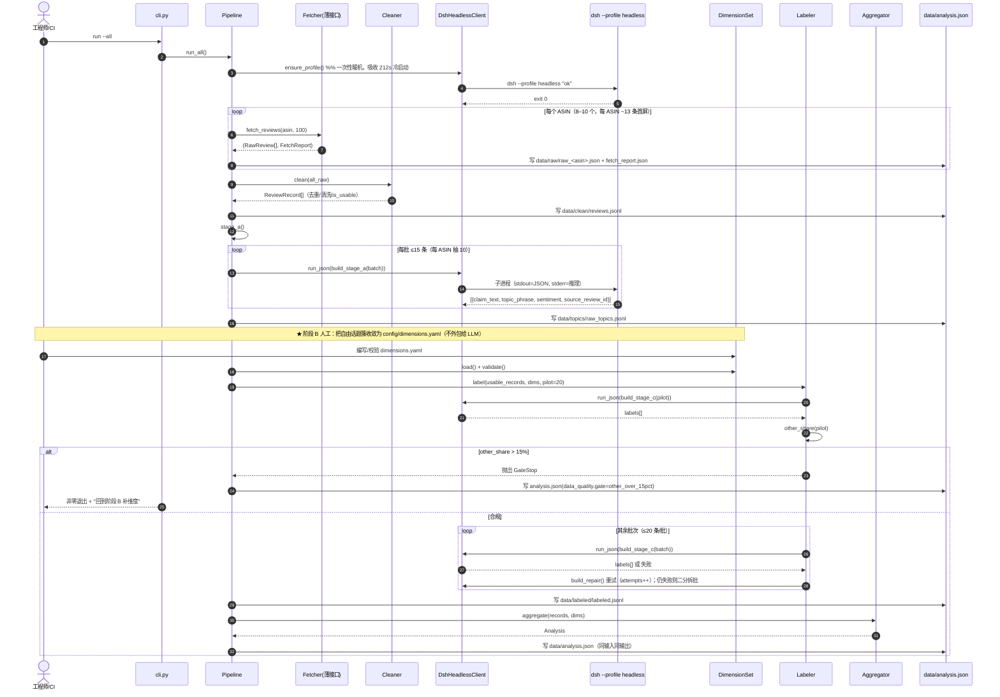
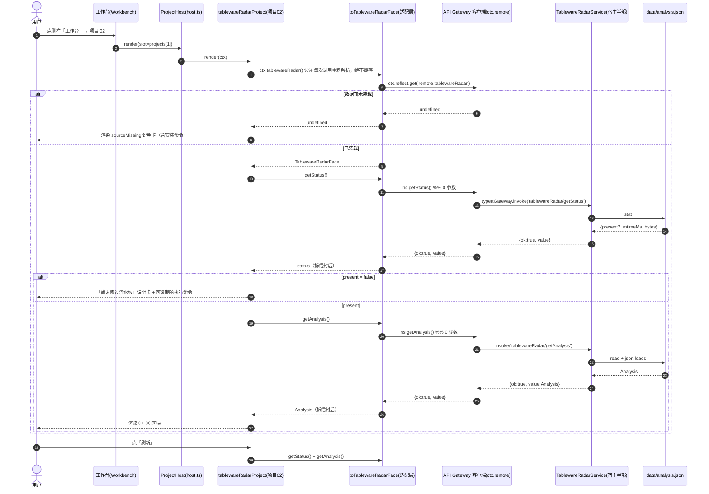
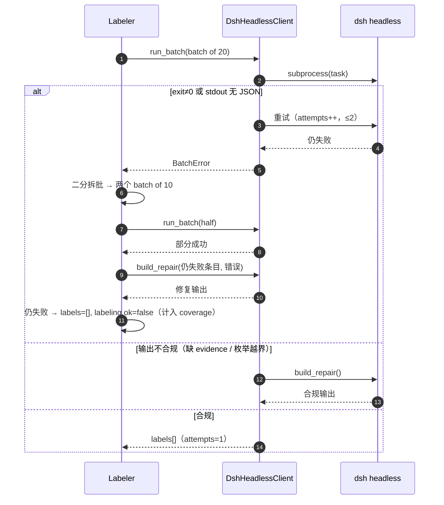
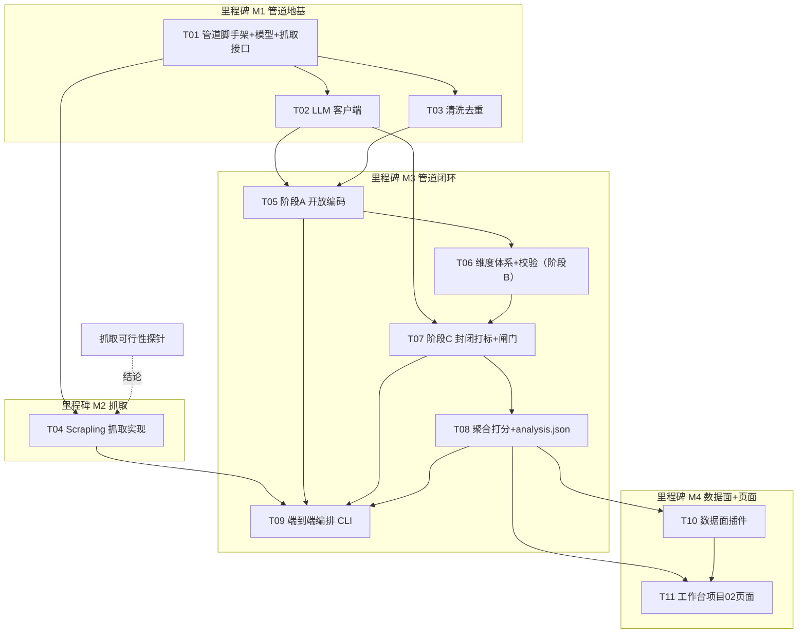

# dsh-tableware-radar · 系统架构设计与任务分解

> 版本：v1.1（MVP）—— 已对齐 **PRD v1.2**（R2/R4/R5/R6 已裁定落地；R1/R3 系读 v1.0 产生的重复建议，v1.1 已含）
> 架构师：高见远（Gao）
> 输入：`docs/PRD.md`（**v1.2**，PM 许清楚）
> 状态：待评审 · 未决事项见第 10 节
> 本文档是**实现真源**：数据结构 / 接口签名 / 落盘路径 / 命名约定以此为准，PRD 只定义"要什么"，本文档定义"怎么落"。
> ⚠️ **口径基线**：**PRD v1.3** 起本文档与 PRD 口径一致。已并入 v1.2（R2 `rankable`、R5 `labeling.ok` + 两个分母口径）与 **v1.3**（数据规模 8–10 ASIN、`rankable` 比例式可配置阈值、矩阵 Top 5–8、采样偏差披露、`variant`/`helpful_votes` 可空）；**后续实现不得"统一"两个分母**（见 §7）。

---

## 0. 一句话架构

**Python 离线管道**（抓取 → 清洗 → 两阶段 LLM 打标 → 聚合）产出唯一真源 `data/analysis.json`；**一个 dsh 插件 `dsh-tableware-radar`** 只做数据面（把该文件经 `remote.tablewareRadar` 暴露给浏览器）；**工作台项目位 02 的页面代码住在工作台仓库里**，消费该数据面渲染机会雷达屏。三块彼此解耦：管道可离线跑通并验证，页面在数据面缺席时降级为说明卡。



---

# Part A · 系统设计

## 1. 实现方案与框架选型

### 1.1 核心难点

| # | 难点 | 应对 |
| --- | --- | --- |
| D1 | **反爬可行性**（曾为唯一可能让 MVP 全盘不成立的风险） | **已解除（v1.3 探针）**：纯 HTTP + `impersonate='chrome'` + `stealthy_headers=True` 即够；翻页是**政策墙**而非反爬墙。抓取仍藏在**薄接口** `fetch_reviews(asin, limit) -> RawReview[]` 后面，下游零依赖 |
| D2 | **Python 管道如何调用本机 dsh 的 DeepSeek** | ★ 头号决策，见 §1.3。结论：子进程调 `dsh --profile headless`，**批量调用** |
| D3 | **两阶段方法论**（开放编码发现维度 → 封闭标签打标，禁止 LLM 归类于阶段 A） | 两个独立 stage + 两份独立 Prompt；`dimensions.yaml` 是阶段 B 的人工产物，是阶段 C 的唯一枚举真源 |
| D4 | **打标输出必须机器可解析**（封闭标签、必带证据、other<15%） | 严格 JSON 输出约定 + 三层降级（见 §1.4）+ `attempts` 重试计数 |
| D5 | **浏览器无法读文件** → 页面如何拿到 `analysis.json` | 插件提供 `@Remote` 数据面；页面侧适配层拆信封 + 每次调用重新解析（照抄 jobRadar 范式） |
| D6 | **改动"已在跑"的工作台有回归风险** | 只做**增量改动**（新增 2 文件 + 3 处单点修改），不 inject 可选数据面，`dev.mjs` 的 126 项冒烟测试必须保持全绿 |

### 1.2 技术栈与选型理由

| 层 | 选型 | 理由 |
| --- | --- | --- |
| 抓取/管道语言 | **Python 3.13**（隔离 venv） | PRD 指定；Scrapling 生态在 Python |
| 抓取库 | **Scrapling 纯 HTTP `Fetcher` + `impersonate='chrome'` + `stealthy_headers=True`**（可选 `adaptive=True`） | PRD §8.3；**探针实测结论**（见 §3.3/§1.2 备注）：200、无验证码、无 Cloudflare、3/3 一致。⚠️ **禁用 `solve_cloudflare`**——Amazon 不用 Cloudflare |
| 抓取是否用浏览器 | **否（MVP 不用浏览器）**。分页在第 1 页即撞**登录墙**（评论页 `302→/ap/signin`，分页 AJAX `401`）——这是 Amazon 2024-11 的**政策墙，非反爬墙**，浏览器路径对它无效 | 故 `patchright install chromium` 仅**兜底时才需要**，非前置（见 §6.1） |
| LLM | 本机 dsh 已配置的 **DeepSeek（deepseek-v4-flash，provider=deepseek-official）** | PRD 指定；无需额外 API key |
| 管道依赖管理 | `requirements.txt` + 指定托管 venv | 团队已有 venv 约定，MVP 不需要 pyproject 的复杂度 |
| 数据面 | **dsh 插件 `dsh-tableware-radar`**（Typert `@Remote` 命名空间 `tablewareRadar`） | 沿用 job-radar 既有格局；宿主天然持有文件读取权限 |
| 页面 | **TypeScript / React**，住在 `dsh-plugin-workbench` 的 `src/client/projects/` | 见 §1.5 结构判定 |
| 图表库 | **Mermaid**（本文档） | 团队约定 |
| 备注 | 不引入任何新前端依赖；页面只用手写 SVG/`h()`，沿用 `tokens.ts` | 模块表只给 `react`，`react-dom`/`@deepseek-ai/dsh-client-ui-*` 运行时不可用 |

### 1.3 ★ 头号技术决策：Python 如何调用本机 dsh 的 DeepSeek

**结论：走候选 1 —— 子进程调 `dsh --profile headless "<task>"`，且必须批量调用。**

#### 实测证据（本机 dsh 0.1.5-rc.2 实测，非推断）

| 项 | 实测结果 |
| --- | --- |
| `headless` 是否内置 | ✅ 是。`@deepseek-ai/dsh-app-boot` 的 `PROFILE_TEMPLATES` 里有 `headless: { bundles: ['@deepseek-ai/dsh-base','@deepseek-ai/dsh-headless'], patchReload:'startup' }`。`dsh --help` 也把它当示例 |
| 是否需要手工建 profile | ❌ 不需要。首次 `dsh --profile headless "..."` 自动从模板初始化 `~/.dsh/profiles/headless`（实测已生成，bundles=[base,headless]）。**不要**用 `--from-default-profile headless`（该 flag 会把 headless 当"自定义 profile 名"，而 headless 是 shipped 名，会被拒） |
| 冷启动耗时 | ⚠️ **212s**（首次，含 profile 初始化 + 首次装载）。一次性成本 |
| 热启动耗时（3 条） | ✅ **10.8s**，exit=0，stdout 为干净 JSON |
| 热启动耗时（20 条） | ✅ **11.4s**，exit=0，stdout 为干净 JSON。→ **boot 主导（~8–9s），每条边际成本 ≈0.15s** |
| 输出纯净度 | ✅ **stdout 只含最终答案**；推理增量走 **stderr**（前缀 `dsh: reasoning:`）。20 条那次的 stderr 里能看到完整思维链 |
| 退出码 | 0 = turn 完成；1 = aborted/error/无轮次 |
| 能否约束为纯 JSON | ✅ 能。Prompt 写明"Return ONLY a compact JSON array, no prose, no markdown fences, no tools"，实测 stdout 即 `[{...},...]`，无 code fence |
| 能否关闭长思维链 | ❌/⚠️ 不能按调用开关（`reasoningEffort: high` 来自 `~/.dsh/settings.yaml` 的 `agent-default-model`）。**但它只在 stderr，不污染 stdout**，且本地无费用。不调低，见下 |

#### 为什么否决候选 2（直读 `~/.dsh/.credentials.yaml` 打 API）

- 该文件是**结构化/受保护存储**（`{version, refs, records:[{kind,payload,secret,version}]}`），不是明文 key 文件；脚本读取脆弱（换机器 / 轮换凭据即失效），且绕过 dsh 自身的凭据治理。
- **本架构不依赖它，报告亦不含任何密钥明文。**

#### 为什么否决候选 3（宿主半部借 cordis LLM 服务）

- 架构上"最干净"，但把**离线批处理**挪进**在线插件**，职责错位：dsh 必须常驻、CI/离线不可用、打标失败要经浏览器回传。
- 本项目的打标是一次性的、可重跑的批任务，天然属于离线管道。

#### 落地形态（`pipeline/src/tableware_radar/llm/client.py`）

- 命令构造：**用 `node <dsh bin.js>` 而非 `dsh.cmd`**（规避 Windows `.cmd` 引号地狱；照抄 workbench `scripts/dev.mjs` 的 `findDshEntry()`）：
  `[node_exe, <global>/@deepseek-ai/dsh/lib/bin.js, '--profile', 'headless', <task>]`
  任务文本作为**单个 argv 元素**传入（含换行安全，已实测）。
- **stdout / stderr 必须分开捕获**（`capture_output=True`），只解析 stdout；stderr 写入 `data/logs/labeling.log` 供排障。
- **只调一次 call，批量提交**：单批 20 条已实测健康；建议 `batch_size` 默认 **15–20**（按字符预算封顶，见共享知识 §9）。
- `ensure_profile(timeout=360)`：首次跑管道先做一次"暖机"（空跑一次），把 212s 冷启动挪到一次显式步骤，后续 step 用 60s 超时。

#### 已评估但**不采纳**（team-lead 裁定，见 §10-U5）

曾考虑在 `~/.dsh/profiles/headless/cordis.patch.yml` 叠加一条针对 `agent-default-model` 行的 overlay 调低 `reasoningEffort` 以缩短长批量延时。**本次不做**：推理增量只走 **stderr**、本地无费用，调低它属"为不确定的收益引入不确定的变量"，MVP 保持默认 `high`。

### 1.4 降级与重试策略（对应 PRD §8.4）

| 层级 | 触发 | 动作 |
| --- | --- | --- |
| L0 调用级 | 超时 / 非零退出 / stdout 无 JSON | 重试 ≤2 次（`attempts++`）；超时按 60s（暖机后） |
| L1 解析级 | JSON 解析失败 / 字段缺 `evidence` / `dimension` 不在封闭枚举 | 追加一次"修复式"重试（把错误回喂，要求只补不发明）；仍失败则进 L2 |
| L2 批次级 | 整批不合规 | **二分拆批**重投，隔离坏条目 |
| L3 条目级 | 单条 N 次仍失败 | 产出 `labels: []` + `labeling.ok=false` + `labeling.attempts`，**计入 `labeled_coverage` 分母**，不静默丢弃 |
| **阶段闸门①** | **`other` 占比 > 15%**（pilot 前 20 条可用评论先探；**分母只算 `ok=true`**） | **停止全量打标**，落一份 `analysis.json`（仅含已完成部分）+ `data_quality.gate='other_over_15pct'`，退出码非零，并打印"回到阶段 B 补维度"的指引 |
| **阶段闸门②** | **打标失败率 > 10%**（`ok=false` 占已处理条数的比例；PRD P0-5 v1.2 新增） | **停止全量打标**，`data_quality.gate='failure_over_10pct'`，退出码非零，先修 Prompt 再重跑（⚠️ 与闸门①**分母口径不同**：此处用"已处理条数"，闸门①用 `ok=true` 条数） |
| 环境级 | `node`/`dsh` 找不到、profile 无法初始化 | 阶段 A **快速失败**并给出可复制的修复命令；**绝不**产出空数据假装成功 |

### 1.5 ★ 结构判定：项目 02 页面代码放哪（确认/推翻）

**✅ 确认** team-lead 的判断——**项目 02 的页面代码必须住在工作台仓库**（`dsh-plugin-workbench`），`dsh-tableware-radar` 插件**只提供数据面**。

理由（读源码得出，非猜测）：

1. `src/client/projects/slots.ts` 的 `PROJECT_SLOTS` 是**构建期静态数组**，由工作台自己的 `build.mjs` 用 esbuild **打进工作台 bundle**。
2. 模块加载器**只把 `react` 提供**给插件（`build.mjs` 的 `external: ['react']`；README 明确"不要 import react-dom 或 @deepseek-ai/dsh-client-ui-*，它们在运行时不在模块表里"）。
3. 因此另一个插件的客户端模块**无法在运行时**把自己的项目对象塞进工作台的槽位——没有可供注册的运行时 API。这正是 job-radar 既有格局：`jobRadar.ts` 页面在工作台里，数据来自独立的 `dsh-job-radar` 插件。

**要改的工作台文件与改动点（全部为增量、单点）：**

| 文件 | 新建/修改 | 改动点 |
| --- | --- | --- |
| `src/client/projects/tablewareRadar.ts` | **新建** | 项目 02 页面：`id:'tableware-radar'`、`title:()=>'餐盘碗碟机会雷达'`、`summary`、`icon`、`render:(ctx)=>h(TablewareRadarView,{ctx})`；导出 `TablewareRadarView`、`TABLEWARE_RADAR_ID`。含 4 个状态分支（missing/error/not-generated/ready）与 ①–⑧ 区块 |
| `src/client/projects/tablewareRadarRemote.ts` | **新建** | 适配层：`toTablewareRadarFace(raw)`，**拆信封**（`{ok,value}|{ok,error}`→值或抛错）+ 半挂载按未装载处理。照抄 `jobRadarRemote.ts` |
| `src/client/projects/types.ts` | 修改 | 追加 `TablewareRadarFace`、`TablewareAnalysis*` 类型；`ProjectContext` 追加 `tablewareRadar(): TablewareRadarFace \| undefined` |
| `src/client/projects/slots.ts` | 修改 | 引入并替换索引 1：`[jobRadarProject, tablewareRadarProject, null, null]` |
| `src/client/index.ts` | 修改 | `projectCtx` 追加 `tablewareRadar: () => toTablewareRadarFace(resolveOptionalRemote(ctx, 'remote.tablewareRadar'))`；`__testHooks` 导出新 face/view（供冒烟测试） |

**改工作台是否可接受 / 如何不改坏：**

- **可接受**：工作台在 git 下，改动可评审；且本设计对工作台的改动**是纯增量**（只新增文件 + 3 处单点追加）。
- **防回归硬约束**：
  1. **绝不**把 `remote.tablewareRadar` 写进工作台的 `inject`（会让整个工作台停等一个可选插件）；
  2. 数据面**每次调用重新解析**（另一个插件的客户端半部异步挂载，早一次 `undefined` 不代表之后没有）；
  3. 数据面缺席 → 渲染 `sourceMissing` 说明卡，**不抛错**；
  4. 改完必须跑 `node scripts/dev.mjs`（build + **126 项冒烟** + 重装 + 校验副本一致），冒烟不全绿不得合入；
  5. 页面开发期与插件解耦：把 `remote.tablewareRadar` 不装，页面应稳定渲染"未装载"卡——这让页面可以先于数据面完成并评审。

**仓库布局（ratify，仅两处微调）：** 采纳 team-lead 的布局，补 `config/`（PRD §8.2 指定 `dimensions.yaml` 在 `config/`）并显式区分"新建/修改"：

```
F:\Samuel\dsh-plugins\dsh-tableware-radar\
  pipeline/     # Python：抓取 → 清洗 → 打标 → 聚合
  plugin/       # dsh 插件包 dsh-tableware-radar（宿主半部 + 客户端半部 + package.json + cordis.patch.yml）
  config/       # dimensions.yaml（维度唯一真源，含版本号）
  data/         # 中间产物与 analysis.json（页面唯一真源）
  docs/         # PRD.md、ARCHITECTURE.md、*.mermaid
  probe/        # 工程师的抓取探针脚本与报告
```

### 1.6 ★ 数据面插件实现路径（第二风险点，磁盘上有现成样板）

浏览器无法读文件，所以数据面必须经 `@Remote`。经实测，**第三方插件无需 Typert 生成器**——可**手写清单**（磁盘上有两个在跑的样板）：

- `~/.dsh/profiles/web/node_modules/dsh-cost-meter/lib/typert.host.js` —— 手写 `TYPERT` 清单：`{ package, face:'host', invocations:[{id, service, namespace, method, invocation:{kind:'direct'}, parameters:[{name,wire,source:'json',codec}], result:codec}], model:{...} }`，codec 必须是 `{ mode:'strict', typeSymbol, schema: <zod v4 实例> }`。由 `@deepseek-ai/dsh-typert-loader` **自动扫描 `./typert` 导出并注册**。
- `~/.dsh/profiles/web/node_modules/dsh-cost-meter/lib/client.js`（`$mount` 处）—— 客户端半部：`inject=['remote']`（若报 `cannot get property "typert" without inject` 则补 `'typert'`），`apply(ctx)` 内 `const dispose = await ctx.remote.$mount(contribution)`，再 `ctx.effect(() => () => dispose(), '...')`。`contribution` 是**内嵌在客户端 bundle 里的手写描述符集**（strict codec，zod 打进 bundle）。
- 另一例：`dsh-at-file`（含 `./client` + `@deepseek-ai/dsh-typert-protocol` peer）。

契约要点（客户端 `$mount` 校验，读 `dsh-api-gateway/lib/client.js` 得到）：

- `requireStrictDescriptor(descriptor)` → **每个参数 codec 与 context codec 的 `mode` 必须是 `'strict'`**，否则 `client api: ... has no strict codec`。→ 所以**不能**只靠宿主 `@Remote` 的 SRC 兜底，客户端贡献必须是 strict 描述符。
- 网关按描述符声明的 **`parameters.length` 严格校验实参个数**（多一个少一个都被拒）。→ 本设计**所有方法都用 0 参数**，从根上规避该脚坑。

> **降级/替代方案（若数据面成本过高）**：`remote.workspaceFiles.read(sessionId, path, range, signal)`（`@deepseek-ai/dsh-api-workspace-files`，web profile 已挂载）可读**工作区外绝对路径**。理论上页面可直接读 `analysis.json`，省掉整个自定义插件。**但**它要求调用方携带一个已授权的 `sessionId`，而工作台面板是全局的、未必有会话；`absolute/<path>` 无授权 Session 会以 `workspace-file/unknown-workspace` 失败。故**仅作备选**，主选仍是自定义插件（PRD §7.1 也如此要求）。

---

## 2. 文件列表及相对路径

### 2.1 新建（`F:\Samuel\dsh-plugins\dsh-tableware-radar\`）

| 相对路径 | 职责 |
| --- | --- |
| `pipeline/requirements.txt` | Python 依赖（见 §6） |
| `pipeline/src/tableware_radar/__init__.py` | 包标记 + 版本号 |
| `pipeline/src/tableware_radar/config.py` | 路径常量、**ASIN 清单（8–10 个）**、批大小、超时、闸门阈值、**`rankable` 阈值（`HITS_MIN` / `ASIN_RATIO` / `ASIN_FLOOR`）**、**矩阵列数 `MATRIX_TOP_ASINS`**、每 ASIN 目标条数 |
| `pipeline/src/tableware_radar/models.py` | 数据类：`RawReview` / `ReviewRecord` / `Label` / `Dimension` / `Analysis` 等 |
| `pipeline/src/tableware_radar/fetch/__init__.py` | 导出 `get_fetcher()` 工厂 |
| `pipeline/src/tableware_radar/fetch/base.py` | **薄接口** `Fetcher` Protocol + `RawReview` + `FetchReport`（探针契约） |
| `pipeline/src/tableware_radar/fetch/amazon_uk.py` | 默认且唯一的 `Fetcher` 实现：**纯 HTTP + `impersonate='chrome'` + `stealthy_headers=True`**（**无浏览器 / 无代理 / 无登录 / 无翻页**）；**探针确认后按结论重写本文件** |
| `pipeline/src/tableware_radar/fetch/fixture.py` | 离线/测试用固定数据 fetcher（让下游在探针未回时也能开发） |
| `pipeline/src/tableware_radar/clean.py` | 清洗去重（`review_id` 去重、去 HTML、归一空白、语言标记、`is_usable`） |
| `pipeline/src/tableware_radar/llm/__init__.py` | — |
| `pipeline/src/tableware_radar/llm/client.py` | ★ `DshHeadlessClient`：子进程调用 + JSON 抽取 + 重试 + 暖机 |
| `pipeline/src/tableware_radar/llm/prompts.py` | 阶段 A / 阶段 C Prompt 模板与 `prompt_version` |
| `pipeline/src/tableware_radar/dimensions.py` | `dimensions.yaml` 加载 + 校验（枚举完整性、版本号） |
| `pipeline/src/tableware_radar/stage_a_topics.py` | 阶段 A：开放编码（抽样 → claim+topic_phrase，**禁止归类**） |
| `pipeline/src/tableware_radar/stage_c_label.py` | 阶段 C：封闭打标（含 other 闸门 + 二分重投） |
| `pipeline/src/tableware_radar/aggregate.py` | 聚合打分 → `analysis.json`（attention/net_sat/opportunity 等） |
| `pipeline/src/tableware_radar/cli.py` | 端到端编排入口（`python -m tableware_radar.cli run --all`） |
| `pipeline/tests/test_clean.py` / `test_aggregate.py` / `test_llm_client.py` | 单元测试（不依赖真实网络/LLM） |
| `config/dimensions.yaml` | 维度体系 v1（阶段 B 人工产物，唯一真源） |
| `config/dimensions.example.yaml` | 结构示例（供阶段 B 前占位与校验） |
| `plugin/package.json` | 插件包声明（`exports['./typert']`、`exports['./client']`、`dsh.bundle.patch`、`dsh.client.platform`） |
| `plugin/cordis.patch.yml` | `insert: [{id: dsh-tableware-radar, name: dsh-tableware-radar}]` |
| `plugin/build.mjs` | esbuild 构建：`lib/index.js`(ESM) + `lib/typert.host.js`(ESM) + `lib/client.js`(loader 信封) |
| `plugin/scripts/dev.mjs` | build + 冒烟 + 装进 web profile + 校验副本（照抄 workbench 的 `dev.mjs`） |
| `plugin/src/index.js` | **宿主半部**：定义 `tablewareRadar` 服务（读 `analysis.json`）、`ctx.provide('tablewareRadar', svc)` |
| `plugin/src/typert.host.js` | **手写 `TYPERT` 清单**（zod strict codec）：`getAnalysis`/`getStatus` 各 0 参数 |
| `plugin/src/client/index.js` | **客户端半部**：`inject` + `apply(ctx)` → `ctx.remote.$mount(contribution)` |
| `plugin/src/client/contribution.js` | 手写客户端贡献描述符（strict codec，zod 打入 bundle） |
| `plugin/README.md` | 安装说明（`dsh plugin --profile web add "file:.../plugin"`） |
| `docs/ARCHITECTURE.md` | 本文档 |
| `docs/class-diagram.mermaid` | 类图 |
| `docs/sequence-diagram.mermaid` | 时序图 |
| `probe/README.md` | 探针结论回填位（工程师维护） |

### 2.2 修改（`F:\Samuel\dsh-plugins\dsh-plugin-workbench\`）

| 相对路径 | 改动点 | 风险 |
| --- | --- | --- |
| `src/client/projects/types.ts` | 追加 `TablewareRadarFace` / `TablewareAnalysis*` / `TablewareStatus`；`ProjectContext` 追加 `tablewareRadar()` | 低（纯追加） |
| `src/client/projects/slots.ts` | 引入 `tablewareRadarProject`；索引 1 由 `null` 替换 | 低（单行） |
| `src/client/index.ts` | `projectCtx` 追加 `tablewareRadar` 解析器；`__testHooks` 追加导出 | 低（纯追加） |
| `src/client/projects/tablewareRadar.ts` | **新建**（见 2.3） | — |
| `src/client/projects/tablewareRadarRemote.ts` | **新建** | — |
| `scripts/smoke-client.mjs` | 追加项目 02 的冒烟断言（U9 采纳：未装载渲染 sourceMissing、装入渲染 ①–⑧） | 低 |

> 说明：`tablewareRadar.ts` / `tablewareRadarRemote.ts` 属"在工作台仓库新建"，其余为"修改"。

---

## 3. 数据结构与接口

### 3.1 评论打标记录 schema（JSONL 一行一条，对齐 PRD §5.1）

```jsonc
{
  "review_id": "string",            // 平台 ID；缺失用 sha1(asin+reviewer+date+body[:120]) 兜底
  "asin": "string",                 // B0XXXXXXXX
  "marketplace": "amazon.co.uk",
  "source": {                       // 抓取面，仅溯源，不参与聚合
    "url": "string",
    "fetched_at": "ISO datetime",
    "fetcher_version": "string",
    "verified_purchase": true,
    "variant": null                   // ★ v1.3 可空：本样本实测 13/13（商品页 [data-hook="format-strip"]，如 "Size Name: 10.5 Inch"）；并非所有 listing 都带该 strip
  },
  "raw": {
    "rating": 1..5,
    "title": "string",
    "body": "string",
    "review_date": "YYYY-MM-DD",
    "helpful_votes": null,            // ★ v1.3 可空：实测 7/13（无票评论无节点）→ 缺失是常态
    "country": "GB"
  },
  "content": {
    "text": "string",               // 清洗后正文（去 HTML、合并 title+body）
    "lang": "en",
    "token_count": 0,
    "is_usable": true               // false 者不计入聚合分母
  },
  "labels": [
    { "dimension": "DUR|CLE|AES|SIZ|PCK|SCN|STR|HAN|VAL|OTHER",
      "dimension_name": "耐用性",     // ★ 中文显示名，与 dimension 一一对应（PRD Q6，v1.2 必带）
      "value": "string",            // 必须来自 dimensions.yaml；OTHER 时填自由话题短语
      "polarity": "pos|neg|neutral|mixed",
      "confidence": 0.0,
      "evidence": "string" }        // ★ 英文原文 ≤160 字符，不翻译；无 evidence 视为不合格输出
  ],
  "labeling": {                     // ★ required: ["ok"]（PRD §5.1）
    "ok": true,                     // ★ R5：false = 本条未成功打标（超时/不合规/重试耗尽），labels 可能为空
    "error": "string",              // ok=false 时的失败原因（超时/输出不合规/重试耗尽）
    "model": "deepseek-v4-flash",
    "prompt_version": "prompt-0.3",
    "dimension_set_version": "dims-v1",
    "labeled_at": "ISO datetime",
    "attempts": 1                   // >1 说明曾输出不合规
  },
  "derived": {
    "sentiment_overall": "pos|neg|neutral|mixed",
    "summary_en": "string",
    "supplier_action": "string"     // 仅高机会分维度生成（切入口清单）
  }
}
```

### 3.2 `analysis.json` schema（页面唯一真源，对齐 PRD §6）

```jsonc
{
  "generated_at": "ISO datetime",
  "dimension_set_version": "dims-v1",
  "sample": {
    "asins": ["B0...", "B0...", "…"],   // ★ v1.3：8–10 个 ASIN，每 ASIN ~13 条（首屏口径，无登录态）
    "comments_total": 0,
    "comments_usable": 0,
    "asins_with_data": 0,           // ★ v1.3：usable>0 的 ASIN 数（rankable 比例阈值的分母 N）
    "labeled_coverage": 0.0,        // 成功打标数 / comments_usable（分母含 ok=false）
    "date_range": { "from": "YYYY-MM-DD", "to": "YYYY-MM-DD" },
    "per_asin": [ { "asin": "B0...", "title": "string", "fetched": 0, "usable": 0,
                    "rating_avg": 0.0, "ok": true } ]   // ok=false 表示该 ASIN 抓取未达标
  },
  "dimensions": [
    { "id": "DUR", "name": "耐用性", "definition": "string",
      "attention": 0.0, "net_sat": 0.0, "satisfaction": 0.0,
      "pos_share": 0.0, "neg_share": 0.0, "hits": 0,
      "asin_count": 0,              // ★ 命中该维度的 ASIN 个数（rankable 第②条的分子）
      "rankable": true,             // ★ v1.3：hits>=HITS_MIN 且 asin_count>=max(ASIN_FLOOR, ceil(ASIN_RATIO*asins_with_data))（阈值全部来自 config.py）
      "low_confidence": false }     // ★ low_confidence = !rankable（二者恒互补）
  ],
  "by_asin": [                       // ★ v1.3：8–10 个 ASIN 全量都在此；③ 区块按 opportunity 降序只渲染 Top config.MATRIX_TOP_ASINS，其余可展开
    { "asin": "B0...", "title": "string", "rating_avg": 0.0,
      "opportunity": 0.0,            // ★ asin_opportunity（PRD §7.4 定稿）= Σ_{d∈rankable} opportunity(d)×neg_share(d,a)；仅用于 ③ 选列，非对外结论；usable≥MIN_REVIEWS_PER_ASIN 才参与排序
      "dimensions": { "DUR": { "attention": 0.0, "net_sat": 0.0, "hits": 0 } } }
  ],
  "top_praise":    [ { "dimension": "AES", "pos_share": 0.0, "example_evidence": "string" } ],
  "top_complaint": [ { "dimension": "PCK", "neg_share": 0.0, "example_evidence": "string" } ],
  "opportunities": [                 // ★ 仅含 rankable 维度，opportunity 降序；SCN/SAF 不入此列（PRD §4.4）
    { "dimension": "PCK", "opportunity": 0.0, "attention": 0.0, "net_sat": 0.0, "hits": 0,
      "asin_count": 0,
      "top_evidence": [ { "quote": "string", "review_id": "string", "asin": "B0..." } ],
      "supplier_action": "string" }
  ],
  "selection_priority": [ { "dimension": "PCK", "opportunity": 0.0, "reason": "一句话理由" } ],
                                     // ★ 长度 <= 7（剔除 SCN/SAF 的 7 个评价维度，再被 rankable 过滤）
  "risk_flags": [                    // ★ v1.2：SAF 合规风险单列，不入机会分
    { "dimension": "SAF", "value": "lead_free_claim",
      "polarity": "neutral", "hits": 0,
      "top_evidence": [ { "quote": "string", "review_id": "string", "asin": "B0..." } ] }
  ],
  "filters": {                       // ★ v1.2：SCN 场景切片计数，仅作筛选器，不入机会分
    "everyday_dining": 0, "entertaining": 0, "afternoon_tea": 0, "roast_dinner": 0,
    "gifting": 0, "kids_family": 0, "baking_serving": 0
  },
  "other_topics": [ { "topic_phrase": "string", "count": 0 } ],   // 下一轮阶段 A 输入
  "data_quality": {
    "failed_asins": [],
    "underfilled_asins": [ { "asin": "B0...", "fetched": 6 } ],   // < config.MIN_REVIEWS_PER_ASIN（默认 10）
    "low_confidence_dimensions": [                                  // ★ 带未达标原因（可据 reason 分支）
      { "id": "STR", "hits": 2, "asin_count": 1, "reason": "hits_below_min" },
      { "id": "SCN", "hits": 9, "asin_count": 2, "reason": "asin_coverage_below_min" }
    ],
    "skipped_unusable": 0,
    "labeling_failures": 0,          // labeling.ok=false 的条数（计入 labeled_coverage 分母）
    "sampling_bias": {               // ★ v1.3：⑧ 采样偏差披露
      "source": "amazon_top_reviews",           // 商品页给的是精选高票 Top reviews，非随机样本
      "effects": ["complaint_dims_overestimated", "casual_mention_dims_underestimated"],
      "note": "广度可消除商品个性偏差；消除不了精选方法论的系统性偏差"
    },
    "gate": null                     // 非 null 时形如 "other_over_15pct" / "failure_over_10pct"
  }
}
```

> **不含任何候选款 / 我方款式字段**（PRD §9.1 边界）：矩阵只渲染**真实 ASIN 列**；列口径 = **`by_asin[].opportunity`（`asin_opportunity`，PRD §7.4）降序 Top 5–8**，其余折叠为"展开看全部"（选列口径见 §7 共享知识）。

### 3.3 抓取层薄接口契约（探针结论回来后只改实现）

```python
# pipeline/src/tableware_radar/fetch/base.py
from typing import Protocol, Sequence
from dataclasses import dataclass

@dataclass(frozen=True)
class RawReview:
    review_id: str          # 平台 ID；缺失时置 ""，由 clean 层用 sha1 兜底
    asin: str
    title: str
    body: str
    rating: int             # 1..5
    review_date: str        # YYYY-MM-DD（缺失允许 ""）
    helpful_votes: int | None   # ★ v1.3 可空：无票评论无节点（实测 7/13 有值）
    country: str            # 多为 "GB"
    verified_purchase: bool
    variant: str | None     # ★ v1.3 可空：本样本实测 13/13（商品页 [data-hook="format-strip"]）；并非所有 listing 都带该 strip
    url: str

@dataclass
class FetchReport:
    asin: str
    requested: int
    fetched: int            # 捕获条数（"是否抓全"判读用）
    platform_cap: int       # ★ v1.3：单 ASIN 平台硬上限（实测 13）——首屏即上限，翻页需登录
    ok: bool                # fetched >= config.MIN_REVIEWS_PER_ASIN（默认 10）视为该 ASIN 成功
    attempts: int
    fetcher_version: str
    swapped_from: str | None  # ★ v1.3：本 ASIN 若由备选池换入，记录被换下的原 ASIN
    error: str              # 失败原因；换 ASIN 全过程汇总进 data/raw/fetch_report.json

class Fetcher(Protocol):
    version: str
    def fetch_reviews(self, asin: str, limit: int) -> tuple[list[RawReview], FetchReport]: ...
```

**约束**：下游（`clean` / `stage_a` / `stage_c` / `aggregate`）**不得 import 任何具体 fetcher**，只经 `fetch.get_fetcher()`。探针结论回来后**只替换 `fetch/amazon_uk.py`**，其余文件零改动。

**★ v1.3 抓取口径（探针已确认）**：默认且唯一需要的实现是 **`Fetcher`（纯 HTTP）+ `impersonate='chrome'` + `stealthy_headers=True`**（实测 200、无验证码、无 Cloudflare、3/3 一致）。**无浏览器、无代理、无登录、无翻页**——翻页在第 1 页即撞登录墙（评论页 `302→/ap/signin`、分页 AJAX `401`），这是 Amazon **2024-11 的政策墙而非反爬墙**。本接口签名与 `RawReview` 结构**保持不变**——恰好证明薄接口隔离是对的（探针结论只改这一个文件）。

### 3.4 宿主半部 `@Remote` 命名空间方法与参数个数

| 项 | 值 |
| --- | --- |
| `package` | `dsh-tableware-radar` |
| `service` / `namespace` | `tablewareRadar` |
| 方法 1 | `getAnalysis()` —— **0 个参数**，返回 `Analysis \| null`（文件不存在→`null`） |
| 方法 2 | `getStatus()` —— **0 个参数**，返回 `{ present, path, mtimeMs, bytes, generatedAt }` |

⚠️ 参数个数硬约束：网关按 `parameters.length` 严格校验。本设计**两方法均 0 参数**，调用方不传参数即合规；新增带参方法时必须同步"TYPERT 清单 + 客户端贡献 + 适配层补实参"三处。

### 3.5 客户端适配层契约（工作台 `tablewareRadarRemote.ts`）

```ts
interface RemoteResult<T> { ok?: boolean; value?: T; error?: { code?: string; message?: string } }
type RawNamespace = Record<string, (...args: unknown[]) => Promise<RemoteResult<unknown>>>

async function unwrap<T>(call: Promise<RemoteResult<T>>, method: string): Promise<T> {
  const r = await call
  if (r === null || typeof r !== 'object' || r.ok !== true)
    throw new Error(r?.error?.message ?? `tablewareRadar.${method} 调用失败`)
  return r.value as T
}

export function toTablewareRadarFace(raw: unknown): TablewareRadarFace | undefined {
  if (raw === null || typeof raw !== 'object') return undefined
  const ns = raw as RawNamespace
  if (typeof ns.getAnalysis !== 'function' || typeof ns.getStatus !== 'function') return undefined
  return {
    getAnalysis: () => unwrap<TablewareAnalysis | null>(ns.getAnalysis(), 'getAnalysis'),
    getStatus:   () => unwrap<TablewareStatus>(ns.getStatus(), 'getStatus'),
  }
}
```

两个不可省的要点（照抄 `jobRadarRemote.ts`）：**① 拆信封**（不拆则 `value` 恒 `undefined`，界面"成功地"渲染成空，最难查）；**② 命名空间每次调用重新解析，绝不缓存**。

### 3.6 类图

见 `docs/class-diagram.mermaid`（下方内联同源）：



---

## 4. 程序调用流程（时序图）

见 `docs/sequence-diagram.mermaid`。三张关键流程：

### 4.1 管道端到端（离线，`cli.py run --all`）



### 4.2 页面加载与数据面（在线）



### 4.3 打标批次降级（L1–L3）



---

## 5. 有序任务列表（含依赖、按实现顺序）

> **粒度说明**：本项目跨 **两种语言 + 两个仓库**（Python 管道 / 插件包 / 工作台页面），且数据面与抓取可行性都是未知项。若强行压到 5 个任务，工程师将拿到无法照做的巨型任务。故按"可独立验证"切分为 11 个任务，归入 4 个里程碑；"配置文件不分散""无一文件一任务"的约束仍然遵守。
> 优先级：P0 = MVP 必须；P1 = MVP 后。

### 里程碑 M1 —— 管道地基（不依赖抓取、不依赖插件）

| ID | 任务 | 源文件 | 依赖 | 优先级 |
| --- | --- | --- | --- | --- |
| **T01** | **管道脚手架 + 数据模型 + 薄抓取接口** | `pipeline/requirements.txt`、`pipeline/src/tableware_radar/{__init__,config,models}.py`、`pipeline/src/tableware_radar/fetch/{__init__,base,fixture}.py`、`pipeline/tests/test_models.py` | — | P0 |
| **T02** | **LLM 客户端（★头号决策落地）** | `pipeline/src/tableware_radar/llm/{__init__,client,prompts}.py`、`pipeline/tests/test_llm_client.py` | T01 | P0 |
| **T03** | **清洗去重** | `pipeline/src/tableware_radar/clean.py`、`pipeline/tests/test_clean.py` | T01 | P0 |

**T01 验收**：`RawReview`/`FetchReport` 数据类稳定；`RawReview` 含 `review_date`、`helpful_votes: int|None`、`variant: str|None`；`config.py` 定义 **24 个月**时间窗常量、**`rankable` 阈值三件套**、**矩阵列数**、每 ASIN 目标条数；`FixtureFetcher` 能按 `config.ASINS`（8–10 个）产出「长度 × 每 ASIN ~13 条」假数据；`get_fetcher()` 工厂可切换 `fixture|amazon_uk`。**（U6/R7）**
**T02 验收**：`ensure_profile()` 成功；`run_json()` 对一次 20 条批量返回纯 JSON（stdout），stderr 不污染；超时/非零退出/坏 JSON 三类失败各有测试桩；`attempts` 计数正确。
**T03 验收**：`review_id` 缺失时用 sha1 兜底；去重差额可见；`is_usable` 规则可测；**早于 24 个月窗口的评论被丢弃且不写入任何中间产物**（不污染分母）。**（U6）**

### 里程碑 M2 —— 抓取实现（依赖探针结论）

| ID | 任务 | 源文件 | 依赖 | 优先级 |
| --- | --- | --- | --- | --- |
| **T04** | **Scrapling 抓取实现（按探针结论重写）** | `pipeline/src/tableware_radar/fetch/amazon_uk.py`、`probe/README.md`（回填结论） | T01、**探针结论** | P0 |

**T04 验收**：8–10 个 ASIN 各产出 `data/raw/raw_<asin>.json`；每 ASIN ≥ `config.MIN_REVIEWS_PER_ASIN`（默认 **10**）视为成功（**单 ASIN 平台硬上限 13 条**，不翻页）；某 ASIN 失败或不足 10 条时**从备选池换一个 ASIN 重试**（不降条数、不转半自动），换选全过程写入 `fetch_report.json`；`fetch_report.json` 记录**「捕获条数 vs 平台上限 13」对比**使"是否抓全"可判读；**只改本文件**，下游零改动即跑通。
**注意**：默认且唯一实现 = **纯 HTTP + `impersonate='chrome'` + `stealthy_headers=True`，无浏览器 / 无代理 / 无登录 / 无翻页**；翻页撞登录墙是 **Amazon 政策墙而非反爬墙**，浏览器路径无效。`solve_cloudflare` 与本项目无关（Amazon 不用 Cloudflare），禁止写入方案与文案。

### 里程碑 M3 —— 管道闭环（阶段 A/B/C + 聚合）

| ID | 任务 | 源文件 | 依赖 | 优先级 |
| --- | --- | --- | --- | --- |
| **T05** | **阶段 A 开放编码** | `pipeline/src/tableware_radar/stage_a_topics.py`、`config/dimensions.example.yaml` | T02、T03 | P0 |
| **T06** | **维度体系与校验（阶段 B 承载）** | `config/dimensions.yaml`、`pipeline/src/tableware_radar/dimensions.py`、`pipeline/tests/test_dimensions.py` | T05 | P0 |
| **T07** | **阶段 C 封闭打标 + other 闸门 + 降级** | `pipeline/src/tableware_radar/stage_c_label.py` | T02、T06 | P0 |
| **T08** | **聚合打分 + analysis.json** | `pipeline/src/tableware_radar/aggregate.py`、`pipeline/tests/test_aggregate.py` | T07 | P0 |
| **T09** | **端到端编排 CLI** | `pipeline/src/tableware_radar/cli.py` | T04、T05、T07、T08 | P0 |

**T05 验收**：每 ASIN 抽 **10 条**（8–10 ASIN 合计 ~80–100 条；不足则用其全部并注明实际条数，不得悄悄少抽）；产出 `data/topics/raw_topics.jsonl`，每条 `{claim_text, topic_phrase, sentiment, source_review_id}`；**Prompt 禁止归类**。**（R6/v1.3）**
**T06 验收**：`dimensions.yaml` 覆盖 PRD §4.2 全部维度，每维具备"定义/判定依据/枚举/正负极性"四要素 **+ 是否参与机会分排序**（`excluded_from_opportunity`，`SCN`/`SAF` 为 true）；`dimensions.example.yaml` 作为阶段 B 起点与 `validate()` 基准；`validate()` 能拒绝"缺枚举/漏标排除项/引用了未定义枚举"的情况。**（R4）**
**T07 验收**：全量评论逐条打标；每条 label 带 `evidence`(英文原文) **+ `dimension_name`(中文名)**；`labeling.ok` 为各条必填，`ok=false` 带 `error` 原因；**闸门①** pilot `other` 占比 > 15%（分母仅 `ok=true`）**或 闸门②** 失败率 > 10% → 立即中止并落 partial `analysis.json` + `gate` 标记（`other_over_15pct` / `failure_over_10pct`）；二分拆批 + `attempts` 生效。**（R5）**
**T08 验收**：attention / net_sat / satisfaction / opportunity 公式与 PRD §4.4 一致；每个维度产出 `hits` + **`asin_count`**，**`rankable = hits≥HITS_MIN 且 asin_count≥max(ASIN_FLOOR, ceil(ASIN_RATIO×asins_with_data))`（三阈值取自 `config.py`，禁硬编码）**、`low_confidence=!rankable`；`opportunities[]`/`selection_priority[]` **仅含 rankable 维度**且 `selection_priority` 长度 **≤7**；产出 `risk_flags[]`(SAF)、`filters`(SCN)，且 `by_asin[]` 每项含 **`opportunity`（`asin_opportunity`，PRD §7.4 定稿 = `Σ_{d∈rankable} opportunity(d)×neg_share(d,a)`，降序用于 ③ 选列；**仅 `usable≥MIN_REVIEWS_PER_ASIN` 的 ASIN 参与排序**）**；`data_quality` 含**采样偏差披露**与带未达标原因的 `low_confidence_dimensions`；同输入同输出（可复现）；**不含任何候选款字段**。**（R2/R7）**
**T09 验收**：`run --all` 一条命令跑通全链路；前置检查——`dimensions.yaml` 不存在则提示"复制 `dimensions.example.yaml` 开始固化"、存在但 `validate()` 不过则拒绝执行；**两种情况打印的都是可直接复制执行的命令**（PRD §8.2）；任一步失败给出可复制修复命令。**（R4）**

### 里程碑 M4 —— 数据面插件 + 工作台页面

| ID | 任务 | 源文件 | 依赖 | 优先级 |
| --- | --- | --- | --- | --- |
| **T10** | **插件包 dsh-tableware-radar（宿主+客户端半部）** | `plugin/package.json`、`plugin/cordis.patch.yml`、`plugin/build.mjs`、`plugin/scripts/dev.mjs`、`plugin/src/{index,typert.host}.js`、`plugin/src/client/{index,contribution}.js`、`plugin/README.md` | T08（数据结构定稿即可，可与 T09 并行） | P0 |
| **T11** | **工作台项目 02 页面 + 适配层 + 接入** | 【新建】`dsh-plugin-workbench/src/client/projects/tablewareRadar.ts`、`tablewareRadarRemote.ts`；【修改】`types.ts`、`slots.ts`、`client/index.ts`、（可选）`scripts/smoke-client.mjs` | T10、T08 | P0 |

**T10 验收**：`dsh plugin --profile web add "file:F:/Samuel/dsh-plugins/dsh-tableware-radar/plugin"` 成功；宿主日志出现服务挂载；`node scripts/dev.mjs` 校验副本一致；`remote.tablewareRadar` 在浏览器出现且 `getAnalysis()/getStatus()` 可调（0 参数）。
**T11 验收**：项目位 02 渲染成功，含 ①–⑧ 全部区块；**③ 对比矩阵默认只渲染 `by_asin` 中 `opportunity`（`asin_opportunity`）降序 Top 5–8 的列（仅 `usable≥MIN_REVIEWS_PER_ASIN` 的 ASIN 参与排序），其余经"展开看全部"查看**；**⑧ 数据完整性区块含"采样偏差"一行**（精选 Top reviews 非随机、抱怨维度高估、随口维度低估）；四种状态（未装载/读取失败/未跑流水线/就绪）都有降级 UI，无白屏；`dev.mjs` 的 126 项冒烟保持全绿（含新增项目 02 断言）；**不 inject** `remote.tablewareRadar`。**（R7/R8）**

**并行建议**：T10 在 T08 的数据结构定稿后即可启动（用 `FixtureFetcher`+假 `analysis.json` 联调），与 T09 并行；T11 的页面可在数据面未装时先开发（稳定渲染"未装载"卡）。

---

## 6. 依赖包列表

### 6.1 Python（`pipeline/requirements.txt`，装进 venv `C:\Users\Samuel\.workbuddy\binaries\python\envs\tableware-radar`）

| 包 | 版本约束 | 用途 |
| --- | --- | --- |
| `scrapling` | `>=0.2,<0.3`（**以探针实测可用版本为准**） | 抓取（默认且唯一：纯 HTTP `Fetcher` + `impersonate='chrome'` + `stealthy_headers=True`） |
| `PyYAML` | `>=6.0` | 读写 `dimensions.yaml` |
| `python-dateutil` | `>=2.9` | 评论日期归一（相对日期→绝对日期） |
| `langdetect` | `>=1.0.9` | `content.lang` 语言标记 |
| `beautifulsoup4` | `>=4.12` | 去 HTML / markdown 清洗 |
| `tenacity` | `>=8.2` | 抓取重试（LLM 重试自实现，保持 `attempts` 可见） |
| `pytest` | `>=8.0` | 单元测试（dev） |

> 显式**不引入**：任何 LLM SDK（走 dsh 子进程，无需 API key）、任何 `pandas`（聚合规模 <1000 条，纯 Python 足够）。
> **浏览器依赖（`playwright` / `patchright` + `patchright install chromium`）定位 = "兜底时才需要"，非 MVP 前置**：L1（纯 HTTP）已实测够用，且浏览器路径对登录墙（**政策墙**）无效——不该让它拖慢环境准备。

### 6.2 npm（`plugin/package.json`）

| 包 | 版本约束 | 类型 | 用途 |
| --- | --- | --- | --- |
| `zod` | `^4.4.3` | dependency | 严格 codec 的 schema（**必须打进客户端 bundle**） |
| `esbuild` | `^0.28.0` | devDependency | 构建宿主/客户端 bundle |
| `@deepseek-ai/cordis` | `^4.0.2` | peer（optional） | 宿主运行时提供 |
| `@deepseek-ai/dsh-typert-protocol` | `*` | peer（optional） | `@Remote` / `TypertRemoteService` 类型 |
| `@deepseek-ai/dsh-api-remotes` | `*` | peer（optional） | 客户端 `remote` 门面类型 |

> 工作台侧**不新增依赖**；页面复用现有 `react` + `tokens.ts`。

---

## 7. 共享知识（跨文件约定）

| 议题 | 约定 |
| --- | --- |
| **目录真源** | 维度唯一真源 `config/dimensions.yaml`；页面唯一真源 `data/analysis.json`。除这两者外，任何中间文件（`raw_*`、`reviews.jsonl`、`raw_topics.jsonl`、`labeled.jsonl`）都是**可重跑产物**，不得被页面或插件读取 |
| **命名** | 维度 ID 大写下划线风格（`DUR`/`CLE`/…）；枚举值下划线小写（`dishwasher_safe_claim`）；`dimension_set_version` 形如 `dims-v1`；`prompt_version` 形如 `prompt-0.3`；`fetcher_version` 语义化（`0.1.0`） |
| **路径** | 一律相对仓库根；Windows 写路径用正斜杠；`analysis.json` 绝对路径由插件的 `config.dataDir` 注入（对齐 job-radar 的 `dataDir` 约定） |
| **错误处理** | Python：阶段级失败**非零退出**并打印可复制修复命令；不吞异常。TS：`render` 抛错由工作台兜住；数据面缺席渲染说明卡**不抛错**；网关返回 `{ok:false}` 由适配层 `unwrap` 抛出并显示原文 |
| **限速** | 抓取：串行、每 ASIN 之间随机 sleep 3–8s；**无翻页**（首屏即撞登录墙，翻页=政策墙）；出现验证码/登录墙立即记入 `FetchReport.error` 并停止该 ASIN（不硬刚） |
| **LLM 限速** | 单进程串行（子进程天然串行）；批间无额外 sleep；批次默认 15–20 条；任务文本长度封顶 **8000 字符**（超长则拆批，规避 Windows 32767 命令行上限） |
| **日志** | 落 `data/logs/`：`fetch.log`、`labeling.log`（含 stderr 推理）、`run.log`。日志**不得**包含密钥；评论正文可含（公开数据） |
| **幂等** | 抓取：`raw_<asin>.json` 按 `review_id` 幂等覆盖；清洗：按 `review_id` 去重；打标：以 `labeled.jsonl` 为缓存，同 `(review_id, dimension_set_version, prompt_version)` 命中则跳过（为 P1-3 增量预留）；聚合：纯函数，同输入同输出 |
| **隐私** | **不落 `reviewer` 名称**（PRD Q5）：仅存 `review_id`；缺失时 sha1 兜底。评论正文为公开数据，可存 |
| **JSON 输出** | LLM 交互统一"只输出 JSON、无 prose、无 markdown fence、不用工具"；Python 侧再做一次健壮抽取（去 fence → `json.loads` → 括号配对兜底） |
| **超时** | 暖机 360s；单次打标 60s；抓取单页 30s |
| **时区/时间** | 一律 ISO 8601；评论日期 `YYYY-MM-DD`（本地无时区语义） |
| **★ 两个分母（口径不同，禁止统一）** | `labeled_coverage` 分母 **包含** `labeling.ok=false` 的条目（衡量"打标跑没跑成功"）；`other` 占比分母 **只算** `ok=true`（衡量"标签体系贴不贴"）。见 PRD §6 / §8.4。⚠️ 实现/测试中若有人觉得这里不一致想合并，会**抵消 R5 的全部收益** |
| **★ 维度口径** | `SCN` 只进 `filters`（场景切片）、`SAF` 只进 `risk_flags[]`，二者**不入** `opportunities[]` / `selection_priority[]`；`rankable = (hits ≥ HITS_MIN) AND (asin_count ≥ max(ASIN_FLOOR, ceil(ASIN_RATIO × asins_with_data)))`（三阈值取自 `config.py`，**禁硬编码**）；`low_confidence ≡ !rankable`（恒互补）；`opportunities[]`/`selection_priority[]` 仅含 `rankable`；`selection_priority[]` 长度 **≤ 7** |
| **★ 矩阵选列口径（③）** | 矩阵**行=维度、列=真实 ASIN**。"机会分"原为**维度级**，ASIN 级用 **`asin_opportunity`（PRD §7.4 定稿）**：`asin_opportunity(a) = Σ_{d ∈ rankable} ( opportunity(d) × neg_share(d, a) )`——权重用**品类级** `opportunity(d)`（~130 条聚合，**稳**）、局部项用该 ASIN 自己的 `neg_share(d,a)`（**有界**）；**不得**用旧版 `attention(d,a) × (1 − satisfaction(d,a))`（两个单-ASIN 噪声量相乘、方差放大）。**参与护栏**：仅 `usable ≥ config.MIN_REVIEWS_PER_ASIN` 的 ASIN 参与选列排序（防"2 条评论靠 1 条差评霸榜"）；不达标者仍可经"展开全部"看到。按此**降序**取前 `config.MATRIX_TOP_ASINS`（默认 5，可调 5–8）列。**排序排除**同维度级：`SCN`/`SAF` 不计入、只累加 `rankable`。⚠️ **不是对外结论**——页面**不得**展示"这个 ASIN 机会分 X"作为对商品的评价 |
| **★ 采样偏差（⑧）** | `data_quality.sampling_bias` 必须披露：商品页给的是 Amazon **精选高票 Top reviews，非随机样本**；偏差方向 = **抱怨类维度高估、随口一提的维度低估**；并点明"广度消除的是**商品个性偏差**，消除不了**精选方法论的系统性偏差**"。页面 ⑧ 区块固定展示此一行 |
| **★ 中英双语** | 每条 label 必带 `dimension_name` 中文显示名；维度 ID 与枚举用英文下划线；`evidence` 为英文原文**不翻译**（PRD Q6 / §5.1） |
| **不引入** | 模块表只有 `react`（客户端插件侧）；Python 侧不引 LLM SDK；全局不引 `pandas`；`analysis.json` **不含任何候选款字段**（PRD v1.1 边界） |

---

## 8. 任务依赖图



**关键路径**：`T01 → T02 → T05 → T06 → T07 → T08 → T10 → T11`。
**可并行**：`T03` 与 `T02` 并行；`T04` 独立于 LLM 链（等探针）；`T10` 在 `T08` 定稿后与 `T09` 并行。

---

## 9. 关于 PRD 的修订建议（裁定结果 · 依据 PRD v1.3）

> 口径基线：以下裁定以 **PRD v1.3** 为准。R1/R3 系我读 v1.0 时产生的重复建议——v1.1 已含该口径，无需改动；R2/R4/R5/R6 已在 v1.2 批准落地；**R7/R8/R9 为 v1.3 用户决策（team-lead 传达）**。**后续修订建议一律注明所依据的 PRD 版本号**（PRD §9.3 表尾约定）。

| # | 议题 | 裁定 | 落地位置 |
| --- | --- | --- | --- |
| **R1** | Q8 · SCN 是否参与机会分排序 | **无需改动**（v1.1 已落地：`opportunity` 只在褒贬性维度排序，SCN 仅作切片） | PRD §4.4「排序排除项」 |
| **R2** | 小样本下机会分不稳 | **批准并落地，并在 v1.3 重议阈值**：`rankable = hits≥HITS_MIN 且 asin_count≥max(ASIN_FLOOR, ceil(ASIN_RATIO×asins_with_data))`，未达标保留展示但标 `low_confidence`、不排序 | PRD §4.4 阈值行 + 理由；§6 字段；§7.2③⑧；§10.4；本文档 §3.2/§7 |
| **R3** | §7.2 草图 vs §边界冲突 | **无需改动**（v1.1 已删候选款列，用户明确"不做候选款"） | PRD §9.1 |
| **R4** | 阶段 B 人工但流水线要能自动跑 | **批准并落地**：`dimensions.example.yaml` + `validate()` + `run --all` 快速失败 | PRD §4.1；§8.2；§10.2 |
| **R5** | §5.1 未表达"打标失败" | **批准并落地**：`labeling.ok`（+ 配套 `error`）；两个分母口径写入 §6/§8.4 | PRD §5.1；§5.2；§6；§8.4；§10.3 |
| **R6** | 阶段 A 抽样量 | **批准并落地；v1.3 随规模调整**：每 ASIN 抽 **10** 条（8–10 ASIN 合计 ~80–100），不足则用其全部并注明实际条数（30 条在单 ASIN ~13 上限下物理不可得） | PRD §4.1 |
| **R7** | **数据规模变化使 `rankable` 阈值失效** | **v1.3 用户决策**：规模改为 **8–10 ASIN × 每 ASIN ~13 条**后，原 `asin_count≥2` 几乎必然满足、护栏形同虚设 → 改为**成比例且可配置**：`hits≥HITS_MIN`（保"跨≥3 个商品复现"的实质约束）+ `asin_count≥max(ASIN_FLOOR, ceil(ASIN_RATIO×asins_with_data))`（比例项保证扩到 30 个 ASIN 不用改代码）。两阈值全部来自 `config.py`。**连带**：降级安全阀「`rankable` 维度 < 3 个」口径不变，但理由更新为守"10 个商品里只有 1–2 个维度达标" | PRD §4.4；本文档 §3.2/§7/§10（T01/T08） |
| **R8** | **③ 对比矩阵列数过多（15–30 列不可用）** | **v1.3 用户决策**：矩阵只列**机会分 Top 5–8 的 ASIN**，其余可展开。因"机会分"是**维度级**指标，ASIN 级选列口径采用 **`asin_opportunity`（PRD §7.4 定稿）**——`Σ_{d∈rankable} opportunity(d)×neg_share(d,a)`（**品类级稳定权重 × 局部有界负向占比**；非旧版 `attention(d,a)×(1−satisfaction(d,a))`），仅作选列启发式、非对外结论；并要求 `usable ≥ MIN_REVIEWS_PER_ASIN` 方参与排序 | PRD §7.4；本文档 §3.2/§7（T08/T11） |
| **R9** | **⑧ 缺少"采样偏差"披露** | **v1.3 用户决策**：新增披露——商品页是 Amazon **精选高票 Top reviews 非随机样本**，抱怨类维度高估、随口维度低估；广度消不掉"精选方法论的系统性偏差"。`data_quality.sampling_bias` 承载，页面 ⑧ 展示 | PRD §7.2⑧；本文档 §3.2/§7（T08/T11） |

**PM 补充的两条口径（我全盘接受，已并入本文档 §3.1/§3.2/§7）**：
1. `selection_priority[]` 长度由"=7"修正为 **≤7**（先剔 SCN/SAF，再被 `rankable` 过滤）。
2. **两个分母口径刻意不同、禁止统一**：`labeled_coverage` 分母含 `ok=false`；`other` 占比分母只算 `ok=true`。

---

## 10. 待明确事项

| # | 事项 | 影响 | 现状/建议 |
| --- | --- | --- | --- |
| **U1** | **抓取可行性** | 决定 T04 是否可实现、MVP 是否成立 | **已解除（探针结论，v1.3）**：`Fetcher`（纯 HTTP）+ `impersonate='chrome'` + `stealthy_headers=True`，**200、无验证码、无 Cloudflare、3/3 一致**；**无浏览器 / 无代理 / 无登录 / 无翻页**（翻页撞登录墙 = 政策墙）。架构隔离成立：只改 `fetch/amazon_uk.py`，契约不变；结论回填 `probe/README.md` |
| **U2** | 数据面插件的 `$mount` 贡献描述符精确形状 | 决定 T10 能否一次跑通 | 已定位样板 `~/.dsh/profiles/web/node_modules/dsh-cost-meter/lib/client.js`（`$mount` 处）。建议先跑通最小 `getStatus()` 再扩展；备选方案见 §1.6 |
| **U3** | 客户端半部 `inject` 是否需要 `typert` | 影响插件能否挂载 | cost-meter 只 inject `['remote']`；workbench README 实测曾需 `typert`。**先试 `['remote']`，报 `cannot get property "typert" without inject` 再加 `'typert'`** |
| **U4** | ASIN 数量与取值（PRD Q1） | 决定抓取输入与结论参考价值 | **已定（v1.3 用户决策，勿再变更）**：**我方自选 8–10 个 ASIN，每 ASIN ~13 条（首屏口径），不引入登录态**（先小规模验证，再决定是否扩）。自选标准＝从 UK Best Sellers `plates & bowls` 挑，兼顾评论量（≥100）、价格带（中/高）、评分带（4.0–4.6），并覆盖维度多样性 |
| **U5** | `reasoningEffort` 能否按 profile 调低 | 仅影响打标延时（不影响正确性） | **不做（team-lead 裁定）**：保持默认 `reasoningEffort: high`。推理增量只走 stderr、本地无费用，调低它属"为不确定的收益引入不确定的变量"，MVP 不采纳（详见 §1.3） |
| **U6** | 评论时间窗（PRD Q4） | 影响抓取成本 | **确认**：最近 24 个月；抓取层按日期截断，且**超出窗口的评论不落盘**（避免污染分母）。已落实现要求：T01（`config.py` 时间窗常量 + `RawReview.review_date`）、T03（清洗阶段丢弃窗口外评论，**不写入任何中间产物**） |
| **U7** | `SAF`（合规/安全）维度（PRD Q7） | 影响打标枚举与页面区块 | **已定，以 PRD 为准（team-lead 裁定：MVP 里 SAF 是做，不是"预留"）**。`SAF` 在 MVP 中**照常打标**——与其它 9 个维度走**同一套阶段 C 流程**，`dimensions.yaml` 给它**完整定义**（定义 / 判定依据 / 4 个枚举 / 正负极性例句），产出进 `risk_flags[]` 与页面 **◈ SAF 合规风险区块**；**唯一区别**是它（与 `SCN` 一起）`excluded_from_opportunity: true`，即**不参与** `opportunities[]` / `selection_priority[]` 排序。⚠️ 注意"不计入机会分" ≠ "不做"：§4.2/§6/§7.2/§10 的维度数 = 10 且页面含 ◈ 区块，是 PRD 验收硬项 |
| **U8** | 是否要 `data/logs/` 纳入 `.gitignore` | 仓库整洁 | **采纳**：`.gitignore` 忽略 `data/`（含日志、中间产物），但**保留一份 `data/analysis.json` 示例入库**（供工作台页面在无真实数据时也能开发） |
| **U9** | 工作台 `scripts/smoke-client.mjs` 是否补项目 02 断言 | 回归保障 | **采纳**：给 `smoke-client.mjs` 补项目 02 断言——“未装载时渲染 sourceMissing、装入后渲染 ①–⑧”（已并入 T11 源文件清单） |

---

## 附录 A · 一句话交底

- **头号决策**：`dsh --profile headless "<batch prompt>"` 子进程 + **批量**（20 条实测 11.4s）+ 只解析 stdout + 三层降级。已实测，非纸上谈兵。
- **结构判定**：项目 02 页面**必须**住工作台仓库（`PROJECT_SLOTS` 是构建期静态数组、模块表只有 `react`）；插件只做数据面。**确认** team-lead 判断。
- **抓取**：已由探针解除——纯 HTTP `Fetcher` + `impersonate='chrome'` + `stealthy_headers=True`，**无浏览器 / 无代理 / 无登录 / 无翻页**；翻页撞的是**政策墙**。薄接口隔离成立（只改 `fetch/amazon_uk.py`）。
- **v1.3 口径（用户决策）**：**8–10 ASIN × 每 ASIN ~13 条**；`rankable` 改为**比例式可配置阈值**（`config.py`）；③ 矩阵按 `by_asin[].opportunity`（PRD §7.4）只列 Top 5–8、其余可展开；⑧ 增**采样偏差**披露；`variant`/`helpful_votes` **可空**。
- **剩余待验**：仅数据面 `$mount` 细节（磁盘上有 `dsh-cost-meter` 样板可抄），**不阻塞**管道（项目主体价值）完成与验证。
