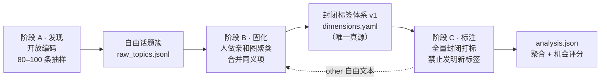
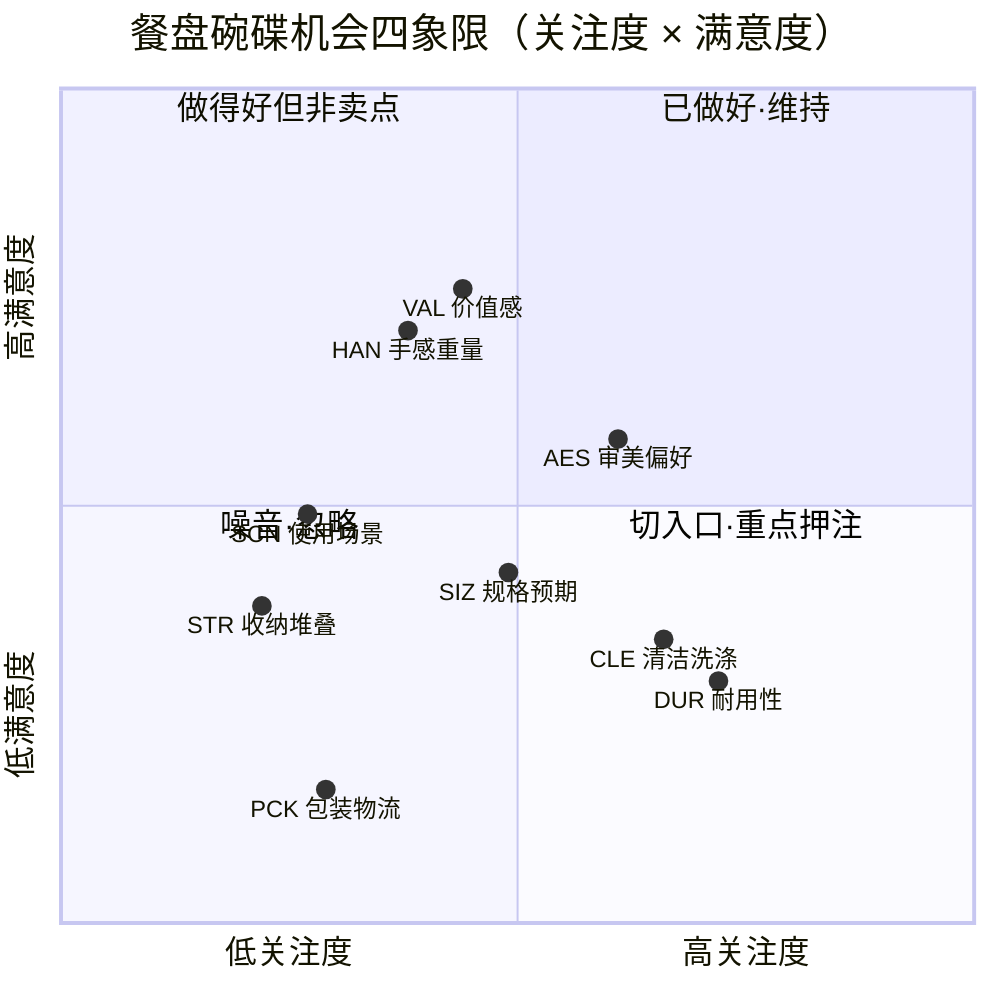
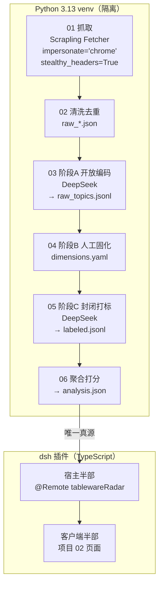

# Amazon UK 餐盘碗碟评论分析系统 —— MVP PRD

> 文档版本：v1.3（MVP；v1.1 修订产品定位，v1.2 修订稳健性与口径，v1.2.1 新增降级安全阀，v1.3 修订数据规模与采样偏差披露）
> **v1.3 实质变更：数据规模由 3 ASIN × 100 条改为 8–10 ASIN × ~13 条（规避登录墙）；新增采样偏差披露；字段可空性修正。**
> **v1.3 定稿：`rankable` 阈值改为成比例可配置（取自 `config.py`）；新增「矩阵选列口径」披露。**
> 产品经理：许清楚
> 状态：十问已闭环 + 架构师 6 条建议已裁定 + 用户决策已落地 + v1.3 定稿两条裁决已写入 · 修订记录见第 9 节

---

## 0. 项目信息

| 项 | 内容 |
| --- | --- |
| Language | 简体中文 |
| Project Name | `dsh-tableware-radar` |
| Programming Language | **Python 3.13**（抓取 + LLM 打标流水线，隔离 venv）+ **TypeScript / React**（dsh 插件展示层，沿用工作台 tokens） |
| 宿主 | `dsh-plugin-workbench` 工作台项目位 **02** |
| 数据源 | Amazon UK `plates & bowls` 类目评论（从零抓取，无历史数据） |
| LLM | 本机 dsh 已配置的 **DeepSeek（deepseek-v4-flash）**，无需额外 API key |
| 抓取库 | Scrapling —— **`Fetcher`（纯 HTTP）+ `impersonate='chrome'` + `stealthy_headers=True`** 即可，无需浏览器 / 代理 / 登录（见 §8.3 实测结论） |
| MVP 范围 | **8–10 个 ASIN × 每 ASIN ~13 条评论**（共约 100–130 条），跑通全链路 |
| 样本规模口径 | 单 ASIN 评论数的**实测硬上限是 13 条**——Amazon 商品页 "Top reviews" 挂件的容量。这是平台政策限制，**不是我们没抓全**。再往上要扩样本，只能**加 ASIN 数**，不能加深单 ASIN |
| 登录态 | **不引入**（用户决策）。所有设计必须在未登录前提下成立 |
| 样本时间窗 | 最近 **24 个月**（已确认） |
| 目标市场 | 英国（跨境卖家：1688 / 拼多多低价进货 → Amazon UK 高价销售） |
| 产品定位 | **自动化境外用户调研**：产出核心点即完成使命，不替代卖家做采购决策 |

### 原始需求复述

跨境出海卖家从国内低价采购餐具、在 Amazon UK 高价销售，核心风险是**选品试错成本**——押错款式，货砸在手里。卖家手上没有任何历史评论数据，需要从零爬取 Amazon UK 餐盘碗碟评论，用 LLM 把非结构化评论拆解为结构化属性数据，最终支撑三个决策问题：

1. 同品类爆品的**好评**集中在什么属性上？
2. 同品类爆品的**差评**集中在什么属性上？
3. 哪些属性是**消费者真正在意、但现有爆品做得不够好**的？（切入口）

系统还要能反向输出：**我们的选品标准该按什么维度、什么顺序排**。

### 边界（已与用户确认，不推翻，只细化）

- **产品定位（v1.1 修订，最优先）**：本系统是**自动化境外用户调研工具**，只负责产出一份**可指导选品的调研结论（核心点）**。**不做选品闭环**——不设候选款、不做候选款对比、不生成采购建议。卖家拿到核心点后**自行去 1688 找货**。
- **品类严格收窄到「餐盘碗碟」**，不扩到整个餐具大类。刀具聊锋利度生锈、杯子聊保温漏水，混在一起指标体系会失效。
- 数据从零开始爬，不做任何"复用历史数据"的设计。
- **8–10 个 ASIN 由我方自选**（Amazon UK `plates & bowls` Best Sellers，兼顾评论量 / 价格带 / 评分分布）；评论时间窗**最近 24 个月**。
- **不引入登录态**（已确认）。由此产生两条不可绕过的后果：① 单 ASIN 只能拿到**精选 Top reviews 的 ~13 条硬上限**，扩样本靠**加 ASIN**；② `variant`（颜色/尺寸/套装）**能拿到**（商品页 `[data-hook="format-strip"]`，本样本实测 **13/13**，如 `"Size Name: 10.5 Inch"`），`helpful_votes` **部分缺失**（实测 7/13）——两者仍按可空处理（并非所有 listing 都带 format-strip），见 §5.1。
- **样本是 Amazon 精选的高票 Top reviews，不是随机样本**。这一偏差必须**随结论一起披露**（§6 `data_quality` / §7.2⑧），且**不得因样本量变大而弱化**。
- MVP **不做**全量 Top20 方案；用 8–10 个 ASIN 的小规模先跑通链路、验证收益，再决定是否扩到 15–30 个 ASIN。
- 节奏：**MVP → 接入 dsh 工作台项目位 → 持续优化**。本次只交付 MVP。

---

## 1. 产品目标

> 用 3 个 Amazon UK 爆品 ASIN 的小样本评论，跑通「抓取 → 开放编码发现维度 → 收敛为封闭标签体系 → 全量打标聚合 → 产出结构化调研结论」的完整链路，**把"人工翻几百条英文评论"这件事自动化**，让跨境卖家在做选品决策前就能看到**英国买家在餐盘碗碟上真正在意什么属性、爆品在哪些属性上被骂得最狠**，并拿到一份可指导选品的**核心点清单**。

**系统边界（v1.1 修订）**：本系统是**自动化境外用户调研工具**，不是选品工具。它只负责产出核心点，**不替卖家选款、不做候选款评估、不生成采购建议**；卖家拿到核心点后自行去 1688 找货。

一句话验收：**卖家看完这一屏，能说出"我要去 1688 重点找包装加固、釉面耐洗碗机循环的款"，而不是"评论挺多的"。**

---

## 2. 用户故事

| # | 角色 | 我想要 | 以便于 |
| --- | --- | --- | --- |
| US-1 | 正在 1688 找货源的跨境卖家 | 先知道英国买家在这个品类上到底在聊哪些话题（而不是我猜的卖点） | 判断供应商给我的卖点清单是否回答了真实需求，避免被"骨瓷""加厚"这类自说自话的话术带着走 |
| US-2 | 准备下单的卖家 | 看到爆品的**好评集中在哪些属性、差评集中在哪些属性** | 避开已被验证的雷区（例如到货破损、洗后掉釉），不用自己花钱试错 |
| US-3 | 拿着调研结论去拍款式的人 | 识别出**高关注度但低满意度**的属性 | 把去 1688 找货的重点方向放在真正的市场空白上，而不是放在噪音属性上 |
| US-4 | 控制成本与退货率的人 | 看到物流/包装类抱怨的强度（占比与负向浓度） | 决定是否值得加钱让工厂做加固包装——因为跨境退货成本远高于包装成本 |
| US-5 | 拿到结论后要自己去跟工厂谈的人 | 结论里带**原文证据**和可执行的工艺要求表述 | 我自己能把这份调研结论翻译成对工厂的谈判语言，例如"提供 ≥50 次洗碗机循环测试报告"——**系统不需要替我谈** |

---

## 3. 需求池

### P0 — Must have（MVP 必须交付，范围严格封顶）

| ID | 需求 | 说明 | 验收标准 |
| --- | --- | --- | --- |
| P0-1 | **评论抓取器** | `Fetcher`（纯 HTTP）+ `impersonate='chrome'` + `stealthy_headers=True` 抓取 **8–10 个 ASIN** 的评论页 Top reviews（**每 ASIN 上限 ~13 条**，见 §8.3），**时间窗最近 24 个月**；ASIN 由我方从 Amazon UK `plates & bowls` Best Sellers 自选（兼顾评论量 / 价格带 / 评分分布），具体清单待架构阶段确定；落盘原始 JSON | 8–10 个 ASIN 各产出 `raw_<asin>.json`；**每 ASIN ≥ 10 条**即视为该 ASIN 抓取成功（**不再有 60 条 / 100 条口径**——13 条是平台硬上限）；**抓取失败照常按 Q3 换备选 ASIN 重试**，全过程写入 `fetch_report.json` |
| P0-2 | **评论清洗与去重** | 归一化文本（去 HTML、去多余空白）、按 `review_id` 去重、标记语言 | 清洗后记录数 = 原始数 − 重复数，差额在报告里可见 |
| P0-3 | **阶段 A 维度发现（开放编码）** | 对每个 ASIN **各抽 10 条**（8–10 ASIN 合计约 80–100 条）跑开放编码，LLM 只做原子观点拆分 + 自由话题短语，**不做任何归类** | 产出 `raw_topics.jsonl`，每条 claim 带 `{claim_text, topic_phrase, sentiment, source_review_id}` |
| P0-4 | **阶段 B 维度固化** | 把自由话题簇收敛成**人可读的封闭标签体系 v1**，写入 `dimensions.yaml`（唯一真源）；以 `dimensions.example.yaml` 为模板，产出须过 `validate()` | `dimensions.yaml` 覆盖第 4 节全部维度，每个维度具备定义/判定依据/枚举/正负极性四要素；**校验不通过时 `run --all` 快速失败**，不产出任何下游文件 |
| P0-5 | **阶段 C 全量打标** | 全量评论按 `dimensions.yaml` 封闭标签打标，LLM 不得发明新标签（只能落到 `other`）；每条记录带 `labeling.ok` | 每条评论产出符合第 5 节 schema 的记录（含 `labeling.ok`）；`other` 占比 < 15%，**分母只算 `ok=true`**；失败率 > 10% 时停止并先修 Prompt |
| P0-6 | **聚合与机会评分** | 按 `ASIN × 维度 × 极性` 聚合，计算关注度 / 净满意 / 机会分，并按 `rankable` 两条阈值决定哪些维度进入排序，输出结构化 `analysis.json` | 产出符合第 6 节 schema 的 `analysis.json`，且可复现（同输入同输出）；`opportunities[]` / `selection_priority[]` 仅含 `rankable` 维度 |
| P0-7 | **工作台项目 02 页面** | 消费 `analysis.json`，渲染机会四象限 + 维度×ASIN 对比矩阵 + 好评/差评 Top + 切入口清单 | 页面在工作台项目位 02 正常渲染；数据源缺失时降级为说明卡而非报错（见 `jobRadar.ts` 的 `sourceMissing` 范式） |

**P0 封顶说明**：MVP 不做增量抓取、不做 Top20、不做多站点、不做历史趋势。任何一个新增想法先进 P1/P2。

### P1 — Should have

| ID | 需求 | 说明 |
| --- | --- | --- |
| P1-1 | **打标质量抽检** | 人工复核 30 条，计算维度命中的一致率，作为 Prompt 迭代的量化依据 |
| P1-2 | **Prompt 版本可追溯** | 每条记录写入 `prompt_version`，允许跨版本对比命中率变化 |
| P1-3 | **增量抓取与去重合并** | 支持按 ASIN 追加抓取新评论而不重复打标 |
| P1-4 | **CSV / 表格导出** | 便于把结论贴进选品表格或发给合伙人（已确认：MVP 不额外产出独立的 Markdown 报告，Q9） |
| P1-5 | **`other` 回流机制** | 被标为 `other` 的自由文本自动汇入下一轮阶段 A 的输入，形成闭环 |
| P1-6 | **机会分权重可手动调整** | 允许卖家对 `opportunity` 的维度权重手工微调并保存（已确认延后至 P1，Q10） |

### P2 — Nice to have

| ID | 需求 | 说明 |
| --- | --- | --- |
| P2-1 | 扩展到类目 Top20 ASIN | 依赖 P0 已验证的反爬可行性 |
| P2-2 | 时间维度趋势分析 | 按评论时间观察属性演化（例如某批次质量滑坡） |
| P2-3 | 自动生成自然语言选品结论 | 由聚合结果直接生成一段"该押什么"的建议文案 |
| P2-4 | 多站点（DE / FR / US）纵横对比 | 需要为每个站点重建语境维度 |

---

## 4. 指标体系定义（核心）

### 4.1 方法论：三段式，禁止拍脑袋定维度

维度体系**不是**在写 PRD 时就定死的。本 PRD 给出的是**候选池 + 判定标准**，最终标签表由阶段 A/B 的数据驱动收敛。这正是"从用户关注度出发"的落地方式。



| 阶段 | 谁做 | 输入 | 输出 | 硬性约束 |
| --- | --- | --- | --- | --- |
| A 发现 | LLM | 每 ASIN 抽样 **10 条**评论 | 原子 claim + 自由话题短语 | **禁止 LLM 归类**——一旦让它归类，它就会按你给的框架回答，发现环节失效 |
| B 固化 | **人（PM / 卖家）** | `raw_topics.jsonl` | `dimensions.yaml` | 人的判断不可外包给 LLM。这一层决定了后面所有数字的含义 |
| C 标注 | LLM | 全量评论 + `dimensions.yaml` | 逐条标注记录 | 只允许从封闭枚举中选值；落不进任何维度的进 `other` 并附自由文本 |

**阶段 A 抽样规则（v1.2 补充 R6；v1.3 随样本规模调整）**：固定**每 ASIN 抽 10 条**（8–10 个 ASIN，合计约 80–100 条）。若某 ASIN 的可用评论不足 10 条，则**取其全部可用评论**，并在 `raw_topics.jsonl` 的元信息与实际报告中**注明实际条数**（不允许悄悄少抽后当成 10 条用）。
> 注：v1.2 时此处为"每 ASIN 抽 30 条"。该口径在 v1.3 已不成立——单 ASIN 实测硬上限只有 ~13 条（§8.3），30 条物理上拿不到。**扩样本只能靠加 ASIN，不能靠加深单 ASIN。**

**阶段 B 的守门人（v1.2 补充 R4）**：阶段 B 仍由**人工固化**，人的判断不外包给 LLM；但产出必须过 `validate()` 校验（维度四要素齐全、枚举非空、ID 唯一、`SAF`/`SCN` 标记正确）。`run --all` 在 `dimensions.yaml` **缺失或校验不通过时快速失败**，并打印**可直接复制的修复命令**——**不允许拿一个残缺的维度表往下跑全量打标**。理由：全量打标是唯一花 LLM 预算的环节，用一张坏表跑完，得到的是"看起来完整但语义错位"的结论，比没有结论更危险，且返工要重跑全量。

### 4.2 维度总表

**P0 维度**（MVP 必做打标）：`DUR` `CLE` `AES` `SIZ` `PCK`
**P1 维度**（MVP 一并打标，小样本命中数可能不足，允许低于统计阈值）：`SCN` `STR` `HAN` `VAL`
**风险维度**（单列展示，**不参与机会分排序**）：`SAF` 合规与安全认证

> **展示与落盘约定（已确认 Q6）**：维度标签与枚举值一律**中英双语**——ID 用英文短码（`DUR` / `chipped_cracked`），显示名用中文（`耐用性` / 磕边开裂）；`evidence` 一律保留**英文原文**，不做翻译。
> **`SCN` 的角色（已确认 Q8）**：`SCN 使用场景` 是**描述性**而非褒贬性维度，极性多数为 neutral。打标保留，但**不参与机会分排序**，仅作聚合切片（可筛选"下午茶场景下的抱怨"）。

| 维度 ID | 维度名称 | 定义 | 判定依据（什么样的评论算命中） | 取值范围（枚举） | 正极 · 好评长什么样 | 负极 · 差评长什么样 |
| --- | --- | --- | --- | --- | --- | --- |
| **DUR** | **耐用性** | 产品在正常使用与清洗周期内的物理完好程度 | 评论出现破损、裂纹、磕边、掉釉、釉面龟裂、变形、褪色、划痕、寿命长短等物理劣化描述，**或反向的**"用了 N 年还很好" | `chipped_cracked`（磕边/开裂）<br/>`glaze_fade`（釉面脱落/褪色）<br/>`crazing`（釉面龟裂）<br/>`scratch`（刀叉划痕）<br/>`warp`（变形）<br/>`general_durability`（笼统耐久评价） | "Had these three years, still perfect, no chips." | "Two arrived chipped." / "The glaze has crazed after a month of dishwasher use." |
| **CLE** | **清洁与洗涤安全** | 对洗碗机 / 微波炉 / 烤箱的适配性，以及清洁难度（英国市场最高频语境） | 出现 dishwasher / microwave / oven safe、洗后变化、手洗难易、染色残留、残渣粘附 | `dishwasher_safe_claim`（声明可机洗）<br/>`dishwasher_damage`（洗后损坏）<br/>`microwave_safe_claim`<br/>`microwave_overheat`（微波后碗体过烫）<br/>`oven_safe_claim`<br/>`handwash_ease`（手洗难易）<br/>`stain_residue`（染色/残留） | "Straight in the dishwasher every day, no issues at all." | "Not dishwasher safe as advertised — came out with a dull film." / "Curry stains will not come off." |
| **AES** | **审美偏好** | 对颜色、图案、造型、釉面质感、整体风格的视觉评价 | 出现颜色 / 花纹 / 设计 / 好看 / 看起来 / 质感 / 和图片一致 等视觉描述 | `colour`<br/>`pattern`<br/>`shape`（造型/深浅/宽窄）<br/>`finish_glaze`（釉面质感：哑光/亮面/肌理）<br/>`style_match`（与自家餐具风格搭配）<br/>`photo_mismatch`（实物与图不符） | "Beautiful speckled glaze — looks far more expensive than it was." | "Colour is much duller than the listing photo." |
| **SIZ** | **规格与预期** | 实际尺寸 / 容量 / 数量与描述、图片及买家预期的偏差 | 出现尺寸、容量、数量、比想象中大/小、与描述不符 | `size_smaller`<br/>`size_larger`<br/>`capacity`（容量是否装得下一餐）<br/>`quantity_mismatch`（套装数量不符）<br/>`listing_accurate`（描述准确） | "Generous size — easily holds a full roast dinner." | "Much smaller than expected, more of a side plate." |
| **PCK** | **包装与物流完好** | 运输包装是否保证到货完好（跨境卖家退货成本的直接来源，英国站高频痛点） | 出现包装、到货破损、运输、碎、泡沫、快递等描述 | `arrived_damaged`（到货即碎/破）<br/>`packaging_weak`（包装单薄）<br/>`packaging_good`（包装到位）<br/>`repack_needed`（需自行加固） | "Double boxed with foam — all six arrived intact." | "Two of the six arrived smashed, box was crushed." |
| **SCN** | **使用场景** | 评论者把产品实际用在什么场合 / 什么餐食上 | 出现具体场景词：dinner party、afternoon tea、Sunday roast、everyday、pasta、cereal、烘焙、儿童餐、送礼 | `everyday_dining`<br/>`entertaining`（宴客）<br/>`afternoon_tea`<br/>`roast_dinner`<br/>`gifting`<br/>`kids_family`<br/>`baking_serving`（烤箱到餐桌/上菜） | "Perfect for our Sunday roast sides." | "Too shallow for a proper curry portion."（场景不适配） |
| **STR** | **收纳与堆叠** | 堆叠稳定性与厨房储物空间占用（英国厨房普遍偏小） | 出现 stack、cupboard、cabinet、nest、takes up space、won't fit | `stacks_well`<br/>`unstable_stack`（堆不稳/易倒）<br/>`bulky`（占地大） | "Stack neatly in a small cupboard." | "They don't nest and won't fit under the shelf." |
| **HAN** | **手感与重量** | 重量、厚度、握持手感、碗沿/边缘触感 | 出现 heavy / light、thick / thin、weight、feel in hand、rim、edge | `heavy_sturdy`<br/>`light_flimsy`（过轻发飘）<br/>`rim_comfort`（碗沿硌嘴/舒适）<br/>`balance`（端持平衡感） | "Nice weight, feels premium in the hand." | "So light they feel like cheap plastic." |
| **VAL** | **价值与复购** | 价格感知、性价比、是否愿意再买 / 推荐 | 出现 value、worth、price、recommend、buy again、for the money | `good_value`<br/>`overpriced`<br/>`would_rebuy`<br/>`would_not_rebuy` | "Great value for a set of six." | "Not worth £30 for what you get." |
| **SAF** | **合规与安全认证** | 产品是否具备食品接触安全相关的认证 / 声明与材质安全信号 | 出现 lead-free、food safe、non-toxic、LFGB、食品安全认证、材质异味/掉色引发的安全担忧 | `cert_claimed`（有认证声明）<br/>`cert_missing`（无认证/未标注）<br/>`safety_concern`（怀疑材质安全）<br/>`odour_taste`（异味/串味） | "Lead-free and food safe — exactly what I wanted." | "No food safety marking anywhere on the box." |

> `SAF` 命中数天然偏低但**一票否决**，因此**不参与 `opportunity` 排序**（不摊进满意度口径），只在页面单列为**风险标记**（已确认 Q7）。

### 4.3 极性定义（所有维度共用一套极性）

| 极性 | 判定 |
| --- | --- |
| `pos` | 评论者对该维度的表达明确为正 |
| `neg` | 评论者对该维度的表达明确为负 |
| `neutral` | 中性陈述（**例如"它是洗碗机安全的"——这是关注度，不是正面评价**） |
| `mixed` | 同一维度的同一枚举值上同时出现正负表达 |

> **关键设计**：维度命中 ≠ 好或坏。**关注度统计所有命中（含 neutral）**，满意度只统计 pos/neg。这是把"消费者在不在聊这件事"和"这件事被聊得好不好"分开的前提——否则一个被中性地频繁提及的属性会被误判为高分属性。

### 4.4 从维度到决策：关注度 / 满意度 / 机会分



> 上图数值为**示意**，用于说明四象限的读法；MVP 跑通后由 `analysis.json` 填入真实值。

| 指标 | 公式 | 含义 |
| --- | --- | --- |
| 关注度 `attention` | `hits(d, a) / valid_comments(a)` | 有多少比例的人在主动聊这个属性。**高关注 = 该属性影响购买决策** |
| 正向占比 `pos_share` | `pos / hits` | 聊到的人里有多少说好 |
| 负向占比 `neg_share` | `neg / hits` | 聊到的人里有多少说坏 |
| 净满意 `net_sat` | `(pos − neg) / hits` ∈ [−1, 1] | 该属性上的口碑净额 |
| 归一满意度 `satisfaction` | `(net_sat + 1) / 2` ∈ [0, 1] | 用于作图与打分 |
| **机会分 `opportunity`** | `attention × (1 − satisfaction)` | **高关注 × 低满意 = 切入口**。这是选品排序的主键 |
| 样本阈值 `rankable` | **两条同时满足**才参与排序：<br/>① `hits(d) >= hits_min`<br/>② `asin_count(d) >= max(asin_count_min, ceil(ratio_min × asins_with_data))`<br/>其中 `asins_with_data` = 本次**实际抓到有效评论**的 ASIN 数 | 小样本防噪声。不达标的维度**保留展示**并标记 `low_confidence`，但**不进入 `opportunities[]` 与 `selection_priority[]` 排序** |

> **`rankable` 最终口径（v1.3 定稿，取代 v1.2 的「跨 ASIN 数 ≥ 2」）**
>
> ```
> rankable(d) = hits(d) >= hits_min
>           AND asin_count(d) >= max(asin_count_min, ceil(ratio_min * asins_with_data))
>
> 其中 asins_with_data = 本次实际抓到有效评论的 ASIN 数
> 默认：hits_min = 3, asin_count_min = 3, ratio_min = 0.3
> ```
>
> **三个默认值必须来自 `config.py`，不得硬编码。**
>
> | 参数 | 默认 | 为什么 |
> | --- | --- | --- |
> | `hits_min` | 3 | 命中数下限。v1.2 沿用，未变 |
> | `asin_count_min` | **3** | 保证"至少跨 **3** 个商品复现"。v1.2 的 `>=2` 在 8–10 个商品下几乎无约束力——两个商品的巧合就能过 |
> | `ratio_min` | **0.3** | **保证扩到 30 个 ASIN 时不用改代码。** 这正是用户"先 8–10 个验证、再决定是否扩"这条路线能走下去的前提——阈值随样本广度自动收紧，而不是等扩完再回头发现结论全是噪声 |
>
> **为什么要有「跨 ASIN 复现」这一条（v1.2 提出，v1.3 加固）**
> `机会分 = 关注度 × (1 − 满意度)` 在"单个 ASIN 上只有个位数命中"时**方差极大**——一个 ASIN 的偏态就足以把整个排序带跑。在**每个 ASIN 仅十余条评论**的样本规模下，「跨 ASIN 复现」是**最便宜的稳健护栏**：某维度若只在 1 个商品上被反复提及，那更可能是**该商品的个体问题，而不是品类共性**，按它排序会让卖家把资源押在一个不可复制的点上。
> 因此本项目的切入口清单只认**跨商品成立**的维度。这条阈值不降低任何维度的可见性（仍然展示、仍可查证据），只把它挡在排序之外。

**由此得到的选品标准排序逻辑**：把 `opportunity` 降序排列 → 前 N 个维度即"我们的选品标准应该按这个顺序排"。这直接回答了用户的第三个问题。

> **排序排除项（已确认）**：`SCN`（描述性、中性为主，Q8）与 `SAF`（合规风险标记、一票否决，Q7）**不参与 `opportunity` 排序**。`SCN` 仅作聚合切片筛选器；`SAF` 单列展示为风险标记。因此 `selection_priority[]` 的候选集 = 9 个评价维度剔除 `SCN`、`SAF` 后的 **7 个**；这 7 个**还需再过 `rankable`**（见上表），故**实际长度为 `≤ 7`，不是固定 7**（v1.2 口径统一）。

> **降级安全阀（v1.2.1 新增）**：若某次运行后 `rankable` 维度**不足 3 个**，页面仍照常渲染，但 ⑦ 区块要**显式提示"本次样本不足以支撑排序结论"**，不得用 1–2 个维度的排序冒充"选品标准"。
>
> 用户拿到的**唯一交付物**就是"核心点"。样本仍然是薄的——**8–10 个 ASIN、每 ASIN 仅十余条、且是精选评论**（见下方采样偏差披露）。若某次运行只剩 1–2 个 `rankable` 维度，页面仍会一本正经地输出「PCK > DUR > …」，而卖家会**当成结论去 1688 找货**——这恰好和这个项目存在的意义完全相反。**宁可明说"数据不够"，也不能给一个看起来像结论、实际是噪声的排序。**
>
> 这条与 R2（跨 ASIN 复现才 `rankable`）是**同一种纪律**，都是在小样本下**拒绝把噪音包装成结论**：一个管"**单个维度**够不够格进排序"，一个管"**整体**够不够格出排序"。两条一起，纪律才闭环。

### 4.5 维度候选池中**故意排除**的项

- **合规与安全认证**（lead-free / food safe / LFGB）：**已确认单列为 `SAF` 维度**（见 4.2），不计入 `opportunity`，只做风险标记。
- **品牌与售后**（客服响应、退货体验）：与产品本身无关，会污染属性结论，MVP 不打标。
- **绝对价格**（£ 数值）：`VAL` 已覆盖价格感知，绝对数值对调研排序无意义。

### 4.6 ★ 采样偏差披露（v1.3 新增，必做，不得省略）

本节是本 PRD 里**唯一一条必须随结论一起对外展示的方法学限制**。§6 的 `data_quality` 与 §7.2 的 ⑧ 区块都必须包含它。

> 本系统的样本来自商品页的 Amazon **精选高票 Top reviews，不是随机样本**。
>
> **偏差方向**：偏长、偏有情绪、偏被大量点赞的评论。
>
> **后果（两个方向的失真，不是只影响一边）**：
> - **会高估的维度**：容易激起长评的抱怨类，例如到货破损、磕边掉釉。
> - **会低估的维度**：被随口一提、不值得单独写一条的，例如收纳堆叠、使用场景。
>
> ⚠️ **关键区分（最容易搞错的一点）**：
> **增加 ASIN 数（广度）消除的是"单个商品的个性偏差"，消除不了"精选评论这个方法的系统性偏差"。**
> 因此**不得因为样本量从 3 个 ASIN 涨到 8–10 个 ASIN，就在页面上弱化或删掉这条披露**。广度解决的是"这个结论是不是只对某一个商品成立"；它**不解决**"我们看到的评论本身是不是有偏"。

**落地要求**：
- §6 `data_quality.sampling_bias` 字段：结构化承载（`source` / `direction` / `over_estimated[]` / `under_estimated[]` / `mitigation`）。
- §7.2 ⑧ 区块：以**常驻文案**展示，**不折叠、不随样本规模变化而隐藏**。
- 若后续引入登录态拿到全量评论，此条披露可相应修订——但那属于 v2 范围。

---

## 5. 评论记录字段需求

一条评论被 LLM 处理后，必须产出一个自包含记录（JSONL 一行一条），使得**聚合环节不需要回看原文即可出结论**，同时**每条结论都能溯源到原文片段**。

### 5.1 JSON Schema

```json
{
  "$id": "tableware-radar/review-label-record/v1",
  "type": "object",
  "required": ["review_id", "asin", "source", "raw", "content", "labels", "labeling"],
  "properties": {
    "review_id": {
      "type": "string",
      "description": "平台评论 ID；缺失时用 sha1(asin + review_date + body[:120]) 兜底，保证幂等去重。**不采集、不落盘 reviewer 昵称**（已确认 Q5）"
    },
    "asin": { "type": "string", "description": "B0XXXXXXXX" },
    "marketplace": { "type": "string", "const": "amazon.co.uk" },

    "source": {
      "type": "object",
      "description": "抓取面。仅作溯源，不参与聚合",
      "properties": {
        "url": { "type": "string" },
        "fetched_at": { "type": "string", "format": "date-time" },
        "fetcher_version": { "type": "string" },
        "verified_purchase": { "type": "boolean" },
        "variant": {
          "type": ["string", "null"],
          "description": "所选颜色/尺寸/套装（来自商品页 `[data-hook=\"format-strip\"]`，如 \"Size Name: 10.5 Inch\"）。**可空**（v1.3）：本样本实测 **13/13 命中**，但并非所有 listing 都带该 strip，故**不要把它写成 required**。**也不要为凑值而造假填充**"
        }
      }
    },

    "raw": {
      "type": "object",
      "description": "原始信息，落盘保留以便复核与重跑",
      "properties": {
        "rating": { "type": "number", "minimum": 1, "maximum": 5 },
        "title": { "type": "string" },
        "body": { "type": "string" },
        "review_date": { "type": "string", "format": "date" },
        "helpful_votes": {
          "type": ["integer", "null"],
          "minimum": 0,
          "description": "**可空，缺失是常态不是异常**（v1.3）。无票评论在 DOM 里就没有票数节点。实测 13 条里仅 7 条有该节点。下游聚合**不得依赖该字段**（当前指标体系中它不参与任何计算）"
        },
        "country": { "type": "string", "description": "评论者国家，UK 站多为 GB" }
      }
    },

    "content": {
      "type": "object",
      "description": "清洗面",
      "properties": {
        "text": { "type": "string", "description": "清洗后的正文（去 HTML、去多余空白、title+body 合并）" },
        "lang": { "type": "string", "description": "ISO 639-1；非 en 的记录标记后可选跳过打标" },
        "token_count": { "type": "integer" },
        "is_usable": { "type": "boolean", "description": "过短/纯表情/纯物流吐槽等无属性信息者为 false，不计入分母" }
      }
    },

    "labels": {
      "type": "array",
      "description": "维度打标结果。一条评论可命中多个维度（这是常态，不是异常）",
      "items": {
        "type": "object",
        "required": ["dimension", "dimension_name", "value", "polarity", "confidence", "evidence"],
        "properties": {
          "dimension": {
            "type": "string",
            "enum": ["DUR", "CLE", "AES", "SIZ", "PCK", "SCN", "STR", "HAN", "VAL", "SAF", "OTHER"]
          },
          "dimension_name": {
            "type": "string",
            "description": "**中文显示名**，与 dimension 一一对应（如 DUR → 耐用性）。已确认中英双语约定 Q6"
          },
          "value": {
            "type": "string",
            "description": "该维度下的枚举值，必须来自 dimensions.yaml；OTHER 时填自由话题短语"
          },
          "polarity": { "type": "string", "enum": ["pos", "neg", "neutral", "mixed"] },
          "confidence": { "type": "number", "minimum": 0, "maximum": 1 },
          "evidence": {
            "type": "string",
            "description": "**英文原文片段**（≤160 字符），**不翻译**。没有证据的标签视为不合格输出，用于给聚合页提供引用"
          }
        }
      }
    },

    "labeling": {
      "type": "object",
      "description": "打标过程元数据，支撑 Prompt 迭代与结果可复现",
      "required": ["ok"],
      "properties": {
        "ok": {
          "type": "boolean",
          "description": "**本条是否成功打标**。v1.2 新增（R5）。没有它，「打标失败」与「这条评论本来就没有任何维度命中」无法区分——两者都是 labels: []。ok:false 的条目必须计入 labeled_coverage 的分母"
        },
        "error": { "type": "string", "description": "ok:false 时的失败原因（超时/输出不合规/重试耗尽），便于定位 Prompt 弱点" },
        "model": { "type": "string", "description": "deepseek-v4-flash" },
        "prompt_version": { "type": "string", "description": "例如 dims-v1 / prompt-0.3" },
        "dimension_set_version": { "type": "string", "description": "dimensions.yaml 的 git-ish 版本号" },
        "labeled_at": { "type": "string", "format": "date-time" },
        "attempts": { "type": "integer", "description": "重试次数；>1 说明该条曾输出不合规，用于定位 Prompt 弱点" }
      }
    },

    "derived": {
      "type": "object",
      "description": "便捷派生字段，不参与核心指标计算",
      "properties": {
        "sentiment_overall": { "type": "string", "enum": ["pos", "neg", "neutral", "mixed"] },
        "summary_en": { "type": "string", "description": "一句话英文摘要" },
        "supplier_action": { "type": "string", "description": "可翻译给工厂的动作项；仅对高机会分维度生成，用于第 6 节切入口清单" }
      }
    }
  }
}
```

### 5.2 记录示例

```json
{
  "review_id": "R3K9QW2LP8",
  "asin": "B0BXXXXXXX",
  "marketplace": "amazon.co.uk",
  "source": { "url": "https://www.amazon.co.uk/product-reviews/B0BXXXXXXX", "fetched_at": "2026-02-11T09:12:44Z", "fetcher_version": "0.1.0", "verified_purchase": true, "variant": null },
  "raw": { "rating": 2, "title": "Lovely but they chip", "body": "Beautiful speckled glaze ... two arrived chipped and the rest crazed after a few dishwasher cycles.", "review_date": "2025-11-03", "helpful_votes": 14, "country": "GB" },
  "content": { "text": "Beautiful speckled glaze ... two arrived chipped and the rest crazed after a few dishwasher cycles.", "lang": "en", "token_count": 78, "is_usable": true },
  "labels": [
    { "dimension": "AES", "dimension_name": "审美偏好", "value": "finish_glaze", "polarity": "pos", "confidence": 0.9, "evidence": "Beautiful speckled glaze" },
    { "dimension": "PCK", "dimension_name": "包装与物流完好", "value": "arrived_damaged", "polarity": "neg", "confidence": 0.95, "evidence": "two arrived chipped" },
    { "dimension": "DUR", "dimension_name": "耐用性", "value": "crazing", "polarity": "neg", "confidence": 0.9, "evidence": "crazed after a few dishwasher cycles" },
    { "dimension": "CLE", "dimension_name": "清洁与洗涤安全", "value": "dishwasher_damage", "polarity": "neg", "confidence": 0.85, "evidence": "crazed after a few dishwasher cycles" }
  ],
  "labeling": { "ok": true, "model": "deepseek-v4-flash", "prompt_version": "prompt-0.3", "dimension_set_version": "dims-v1", "labeled_at": "2026-02-11T09:40:02Z", "attempts": 1 },
  "derived": { "sentiment_overall": "mixed", "summary_en": "Likes the glaze but reports transit chips and crazing after dishwasher use.", "supplier_action": "要求工厂提供 ≥50 次洗碗机循环的釉面耐裂测试报告；出厂加厚珍珠棉+分格纸托" }
}
```

---

## 6. 聚合产物（`analysis.json`）字段需求

这是**工作台页面唯一直接消费的文件**，因此必须自包含：页面上出现的每个数字都能在这里找到出处。

| 字段 | 类型 | 用途 |
| --- | --- | --- |
| `generated_at` | ISO datetime | 页头"读取于/数据截止" |
| `dimension_set_version` | string | 页脚留痕：这一屏的数字是哪版维度体系下算的 |
| `sample` | object | 页头样本概览条：`asins[]`（**8–10 个**）、`comments_total`、`comments_usable`、`labeled_coverage`、`date_range`、`per_asin[]`（含各 ASIN 抓到多少条、是否达标） |
| `dimensions[]` | array | 对比矩阵的行。每项：`{ id, name, definition, attention, net_sat, satisfaction, pos_share, neg_share, hits, asin_count, low_confidence, rankable }`。`low_confidence = !rankable`（**`rankable` 按 §4.4 定稿口径计算，三个阈值取自 `config.py`**） |
| `by_asin[]` | array | 对比矩阵：`{ asin, title, rating_avg, opportunity, dimensions: { <dimId>: { attention, net_sat, hits } } }`。**8–10 个 ASIN 全量都在此**；页面第 ③ 区块只渲染机会分 Top 5–8，其余可展开（见 §7.2③） |
| `top_praise[]` | array | 好评集中 Top3：`{ dimension, pos_share, example_evidence }` |
| `top_complaint[]` | array | 差评集中 Top3：`{ dimension, neg_share, example_evidence }` |
| `opportunities[]` | array | **切入口清单**，按 `opportunity` 降序，**仅含 `rankable` 维度**。每项：`{ dimension, opportunity, attention, net_sat, hits, asin_count, top_evidence: [{ quote, review_id, asin }], supplier_action }` |
| `selection_priority[]` | array | **调研结论的交付形态**：`opportunity` 降序的维度 ID 列表 + 一句话理由。**不含 `SCN` / `SAF`，且仅含 `rankable` 维度**。`SCN`/`SAF` 剔除后剩 7 个评价维度，再被 `rankable` 过滤，故长度为 **≤ 7** |
| `risk_flags[]` | array | `SAF` 合规风险标记（单列，不入机会分）：`{ dimension: "SAF", value, polarity, hits, top_evidence }` |
| `filters` | object | `SCN` 场景切片计数（仅作筛选器，不入机会分）：`{ <scnEnum>: count }` |
| `other_topics[]` | array | 落在 `other` 的自由话题，按频次排序——下一轮阶段 A 的输入 |
| `data_quality` | object | 数据完整性提示：抓取失败/换 ASIN 记录、条数不足 ASIN、**打标失败条数（`labeling.ok=false`）**、低置信度维度及其未达标原因（`hits<3` / 仅 1 个 ASIN）、跳过打标条数、**`sampling_bias`（v1.3 新增，见下）** |
| `data_quality.sampling_bias` | object | **★ v1.3 新增，必填**。采样偏差披露的结构化载体（全文见 §4.6）：`{ source: "amazon_top_reviews_curated", direction, over_estimated: [], under_estimated: [], breadth_does_not_fix: string, note }`。页面 ⑧ 区块**常驻展示**，**不折叠、不随样本规模变化而隐藏** |

> **v1.3 修订（采样偏差，必读）**：`data_quality.sampling_bias` 是**必填字段，不是可选装饰**。我们拿到的是 Amazon **精选高票 Top reviews**，不是随机样本——**抱怨类维度会被高估**（长评更可能来自到货破损、磕边），**随口一提的维度会被低估**（收纳、使用场景）。
> ⚠️ **广度消除的是"单个商品的个性偏差"，消除不了"精选评论这个方法的系统性偏差"。** 因此**不得因为 ASIN 数从 3 涨到 8–10 就在页面上弱化这条披露**。

> **v1.2 修订（R5，重要）**：`labeled_coverage` 的**分子是 `ok=true` 条数、分母是「已发标条数」（`ok=true` + `ok=false`）**。否则"打标失败"会被静默算成"这条评论没有任何维度命中"——而 `labels: []` 在两种情况下长得一模一样。后果是双向的：既会让 `other 占比 < 15%` 这个闸门**形同虚设**，也会把失败**伪装成"维度体系很干净"**。这是本次修订里最容易在实现时漏掉的一条。
>
> **⚠️ 本项目有三个口径不同的分母，禁止统一**（`labeled_coverage` / 闸门①`other`占比 / 闸门②失败率）。三个分母的精确定义与"为什么必须不同"，见 **§8.4「★ 三个分母」表**——实现前请先读那张表。
>
> **v1.1 修订**：本产物**不含任何候选款 / 我方款式字段**。系统只做境外用户调研，候选款对比与采购决策由卖家在线下自行完成（已确认 Q2）。

---

## 7. 工作台项目 02 页面 —— UI 信息架构

### 7.1 宿主约束（来自 `dsh-plugin-workbench`）

- 页面宿主是工作台主区域，**工作台已提供外层滚动容器与内边距**，本项目 `render()` 只返回自己的内容，**不自带滚动容器、不加重外框**。
- 项目实现 `WorkbenchProject` 契约（`id` / `title` / `summary` / `icon` / `render(ctx)`）。
- 数据面通过宿主半部 `@Remote` 暴露，客户端半部从 `ctx` 解析，**每次调用重新解析**（另一个插件是异步挂载的），未装载时渲染说明卡，不抛错——完全对齐 `jobRadar.ts` 的既有范式。
- 视觉沿用工作台 tokens（`tokens.ts`）：`T.bgLayer1`、`T.border1`、`T.ok/warn/danger/brand` 等，浅深主题自动适配。
- 建议 `id: 'tableware-radar'`（不能占用内置的 `control-room`），`title: '餐盘碗碟机会雷达'`。

### 7.2 信息架构草图

```
┌───────────────────────────────────────────────────────────────────────────────┐
│ 餐盘碗碟机会雷达                                    remote.tablewareRadar     │
│ ────────────────────────────────────────────────────      读取于 14:32  [刷新]│
│                                                                               │
│ ① 样本概览（一行 6 格，回答"这份结论有多少数据撑着"）                         │
│ ┌────────┬────────┬────────┬────────┬────────┬────────┐                       │
│ │ ASIN   │ 评论数 │ 有效数 │ 打标率 │ 时间跨度│ 低置信 │                      │
│ │   9    │  104   │   97   │ 100%   │ 22 个月│   2    │                       │
│ └────────┴────────┴────────┴────────┴────────┴────────┘                       │
│   脚注：单 ASIN 上限 13 条（平台硬上限，非抓取不全）——样本量靠 ASIN 数撑      │
├───────────────────────────────────────────────────────────────────────────────┤
│ ② 机会四象限：关注度(→) × 满意度(↑)   气泡=维度，气泡大小=命中数              │
│                                                                               │
│   高  ┌──────────────────────┬──────────────────────┐                         │
│   满  │ 已做好 · 维持        │ ★ 切入口 · 重点押注  │                         │
│   意  │  VAL  HAN            │  PCK   DUR           │                         │
│       ├──────────────────────┼──────────────────────┤                         │
│   低  │ 噪音 · 忽略          │ 关注但难差异化        │                        │
│   满  │  SCN  STR            │  AES  SIZ  CLE       │                         │
│   意  └──────────────────────┴──────────────────────┘                         │
│         低关注  ────────────────  高关注                                      │
│   〔悬浮气泡 → 显示 attention / net_sat / hits / asin_count〕                 │
├───────────────────────────────────────────────────────────────────────────────┤
│ ③ 维度 × ASIN 对比矩阵  单元格 = 关注度 / 净满意                              │
│   列 = 机会分 Top 5–8 的 ASIN（按 asin_opportunity 降序，见 §7.4）；          │
│   下方提供「展开全部 9 个 ASIN」（只增列，不改行序）                          │
│   ⓘ 本区块 5–8 列按 asin_opportunity 选取，不构成商品综合评价（§7.4）         │
│ ┌──────────────┬──────────────┬──────────────┬──────────────┬────────┐        │
│ │ 维度         │ B0…A1 (第1)  │ B0…B2 (第2)  │ B0…C3 (第3)  │ 机会分 │        │
│ ├──────────────┼──────────────┼──────────────┼──────────────┼────────┤        │
│ │ DUR 耐用性   │ 42% / −0.31  │ 38% / −0.20  │ 35% / −0.26  │  0.51  │        │
│ │ PCK 包装物流 │ 33% / −0.64  │ 31% / −0.58  │ 29% / −0.70  │  0.49  │        │
│ │ CLE 清洁洗涤 │ 62% / −0.12  │ 58% / +0.05  │ 55% / −0.09  │  0.33  │        │
│ │ VAL 价值感   │ 41% / +0.52  │ 39% / +0.61  │ 40% / +0.47  │  0.17  │        │
│ └──────────────┴──────────────┴──────────────┴──────────────┴────────┘        │
│  低置信度维度降透明度 + 角标「n不足」；行序 = 机会分降序，仅 rankable 维度    │
├───────────────────────────────────┬───────────────────────────────────────────┤
│ ④ 好评集中在哪（Top3）            │ ⑤ 差评集中在哪（Top3）                    │
│  1. AES 釉面/颜值   61% 正向      │  1. PCK 到货破损   64% 负向               │
│     "Beautiful speckled glaze…"   │     "Two of six arrived smashed…"         │
│  2. VAL 性价比      44% 正向      │  2. DUR 磕边/掉釉  31% 负向               │
│  3. HAN 手感厚重    38% 正向      │  3. CLE 洗后失光   22% 负向               │
├───────────────────────────────────┴───────────────────────────────────────────┤
│ ⑥★ 切入口清单（高关注 × 低满意，按机会分降序，这是整屏的结论位）              │
│                                                                               │
│  ▸ PCK 包装与物流      关注 33% · 净满意 −0.61 · 命中 31 条 · 跨 7 个 ASIN    │
│      证据："two of the six arrived smashed, box was crushed" ×11              │
│      动作项：供应商加厚珍珠棉 + 六分格纸托；出厂单件塑封                      │
│                                                                               │
│  ▸ DUR 耐用性（釉面耐洗碗机）  关注 42% · 净满意 −0.28 · 命中 44 条 ·         │
│      跨 9 个 ASIN                                                             │
│      证据："the glaze has crazed after a month of dishwasher use" ×7          │
│      动作项：要求工厂提供 ≥50 次洗碗机循环测试报告                            │
├───────────────────────────────────────────────────────────────────────────────┤
│ ⑦ 选品标准排序（调研结论的交付形态，由机会分自动生成）                        │
│    PCK > DUR > CLE > SIZ > AES > HAN > VAL                                    │
│    注：SCN 仅作场景筛选器、SAF 单列为风险标记，均不入排序；STR 未达 rankable  │
│    （跨 ASIN 不足），故本屏为 6 项。上限为 7 项                               │
├───────────────────────────────────────────────────────────────────────────────┤
│ ◈ SAF 合规与安全风险标记（单列，不入机会分）                                  │
│    cert_missing 4 条 · safety_concern 1 条 · odour_taste 2 条                 │
│    "No food safety marking anywhere on the box."                              │
├───────────────────────────────────────────────────────────────────────────────┤
│ ⑧ 数据完整性与方法学限制（唯一允许出现"丑话"的地方，不要藏）                  │
│                                                                               │
│  ── ★ 采样偏差披露（v1.3 新增，常驻，不折叠、不随样本量增大而隐藏）──         │
│  本系统的样本来自商品页 Amazon 精选的高票 Top reviews，不是随机样本。         │
│  偏差方向：偏长、偏有情绪、偏被大量点赞的评论。                               │
│  · 会高估：到货破损、磕边掉釉等易激起长评的抱怨类维度                         │
│  · 会低估：收纳堆叠、使用场景等被随口一提的维度                               │
│  · 增加 ASIN 数只消除"单个商品的个性偏差"，消除不了"精选评论的系统性偏差"     │
│                                                                               │
│  ── 数据完整性 ──                                                             │
│  · 单 ASIN 评论数上限 13 条（Amazon Top reviews 挂件容量，平台硬上限，        │
│    非抓取不全）；本屏 9 个 ASIN 共 104 条                                     │
│  · 换 ASIN 记录：B0…E5 抓取失败（0 条）→ 按 Q3 换为 B0…D9（13 条，达标）      │
│  · 本次 9 个 ASIN 有效评论数 10–13 条，全部达 ≥10 条下限                      │
│  · 低置信度维度 2 个（未达 rankable）：STR（命中 2 条 <3）、                  │
│    SCN（仅 1 个 ASIN 提及）→ 已展示但不入机会分排序                           │
│  · 打标失败 3 条（labeling.ok=false，已计入 labeled_coverage 分母）           │
│  · variant 实测 13/13（Size Name）；helpful_votes 缺失 45/104                 │
│  · other 未归类自由话题 6 条 → 点开查看，供下一轮维度发现使用                 │
└───────────────────────────────────────────────────────────────────────────────┘
```

### 7.3 交互与状态

| 状态 | 表现 | 参考实现 |
| --- | --- | --- |
| 数据面未装载 | 整屏替换为说明卡：说明这个项目不自读文件、要去哪里装 `dsh-tableware-radar` 宿主半部 | `jobRadar.ts` → `sourceMissing()` |
| 读取失败 | 说明卡 + 错误原文 + 「重试」按钮 | `jobRadar.ts` → `sourceError()` |
| `analysis.json` 不存在（尚未跑过流水线） | 说明卡 + 一键可复制的流水线执行命令 | 同上范式 |
| 加载中 | 页头显示「正在读取…」，不阻塞整屏 | `jobRadar.ts` toolbar |
| 数据就绪 | 渲染 ①–⑧ 全部区块 + ◈ SAF 风险标记 | — |

**交互极简原则**：MVP 这一屏**只读**，不做任何写操作（不提供"标记""编辑标签"）。理由：MVP 的价值在结论本身，任何可写状态都会引入第二份数据源，破坏"`analysis.json` 是唯一真源"。

### 7.4 `asin_opportunity` —— 第 ③ 区块列选择的依据（v1.3 定稿）

8–10 个 ASIN 同屏放不下，③ 区块**只列机会分 Top 5–8 的 ASIN**，其余由「展开全部」加载。这个"机会分"需要一个**按 ASIN** 的定义（此前的 `opportunity` 都是按维度的）：

```
asin_opportunity(a) = Σ_{d ∈ rankable} ( opportunity(d) × neg_share(d, a) )
其中 opportunity(d) = attention(d) × (1 − satisfaction(d))   ← 维度级，全样本算
     neg_share(d, a) = 该 ASIN 在维度 d 上的负向占比
```

**含义**：**该商品在最值得差异化的问题上，糟糕到什么程度。**

| 项 | 说明 |
| --- | --- |
| 为什么用 `× neg_share` 而不是直接求和 | 矩阵的用途是**看竞品弱在哪**，所以最该占住列位的，是那些**恰好在高机会维度上表现差**的商品——它们在教学上最有信息量。单纯把各维度机会分求和，8–10 个商品之间**拉不开差距**，选列会退化成随意挑 |
| 用途 | **仅用于决定 ③ 区块展示哪 5–8 列**（一个排序启发式） |
| 不是 | **不是对外结论**。页面不得展示"这个 ASIN 机会分 X"作为对商品的评价——它没有这个含义，且单 ASIN 仅 ~13 条评论，本身噪声很大 |
| 排序排除 | 与维度级一致：`SCN` / `SAF` 不计入；只累加 `rankable` 维度 |

#### ★ 矩阵选列口径披露（v1.3 定稿，硬要求）

③ 区块**矩阵上方**必须显示一行小字：

> **当前展示的 5–8 列是按 `asin_opportunity` 选取的，不代表该商品的综合评价。**

并保留「展开全部 N 个」入口。

**为什么这行小字是硬要求**：已经为「降级安全阀」立过"**不藏方法**"的规矩，这里同理。否则用户看到 9 个商品只显示 6 个，会疑惑少了谁，更会**误以为那 3 个被排除是因为它们不重要**——而真相恰恰相反：它们可能**表现更好、没有可学的东西**。
**方法被隐藏时，缺失本身就会变成误导。**

> ⚠️ 此处是 PM 为落实"列 Top 5–8"所做的**必要定义**（此前该指标不存在）。如 team-lead 认为应换一种口径（例如取最大值、或按负向评论数排序），改这一节即可，不影响其它部分。

---

## 8. 技术规范

### 8.1 链路



### 8.2 落盘约定

```
dsh-tableware-radar/
  data/
    raw/raw_<asin>.json           # P0-1 原始抓取
    fetch_report.json             # 抓取成功/失败留痕
    clean/reviews.jsonl           # P0-2 清洗去重
    topics/raw_topics.jsonl       # P0-3 开放编码
    labeled/labeled.jsonl         # P0-5 逐条打标
    analysis.json                 # P0-6 聚合产物 ← 页面唯一消费
  config/
    config.py                     # v1.3 定稿：hits_min / asin_count_min / ratio_min 等阈值的唯一来源（禁止硬编码）
    dimensions.example.yaml       # v1.2 新增（R4）：阶段 B 的模板与校验基准，随代码入库
    dimensions.yaml               # 维度唯一真源（含版本号）；由人据模板固化产出，不入模板库
  docs/PRD.md
```

**`dimensions.example.yaml` 的作用（v1.2 新增 R4）**：它是**阶段 B 的起点与 `validate()` 的基准**——给出每个维度的标准骨架（定义 / 判定依据 / 枚举 / 正负极性 / 是否参与机会分排序），人工固化时以此为模板填写，避免"少写一个枚举""忘了标 `SAF` 不进排序"这类残缺。

`run --all` 的前置检查：`dimensions.yaml` **不存在 → 复制 `dimensions.example.yaml` 开始固化**；**存在但 `validate()` 不过 → 拒绝执行并打印修复命令**。两种情况的提示都要是**可直接复制执行的命令**，不要只给人一句话描述。

### 8.3 抓取层口径（v1.3 实测结论，以此为准）

#### ✅ 唯一需要的 fetcher

> **`Fetcher`（纯 HTTP）+ `impersonate='chrome'` + `stealthy_headers=True`**

实测：**HTTP 200、无验证码、无 robot check、无 Cloudflare、连跑 3 次结果一致。**

**不需要**隐身浏览器、**不需要**代理、**不需要**登录、**不需要**翻页。

#### 🧱 真正的限制是"政策墙"，不是"反爬墙"

- **翻页在第 1 页就撞墙**：独立评论页 302 → `/ap/signin`；翻页 AJAX 端点返回 401。
- 这是 Amazon 自 **2024-11 起对未登录用户关闭"全部评论"** 的**平台政策限制**。
- 因此 **上浏览器 / 换 UA / 上代理全部无效**（已实测）——它不是"识别出你像机器人"，而是"你没登录，这个内容就不给你"。
- 推论：**单 ASIN 评论数上限 ~13 条**（商品页 "Top reviews" 挂件的容量）。这是**硬上限**，写进文档以免后续读者误以为是我们没抓全。**要扩样本只能加 ASIN 数。**

#### ⚠️ 两个常见的错误卖点（不要写进方案或 UI 文案）

- Scrapling 的 **`solve_cloudflare` 对本任务无意义**——**全程未遇到 Cloudflare**。它不是"无效所以别用"，而是"这个任务压根没有这道题"。
- **`StealthyFetcher` 在内核上是 patchright 分支，不是 Camoufox**。不要把两者说成同一个东西。

#### 🔁 失败处理（已确认 Q3，v1.3 沿用）

某 ASIN 抓取失败或不足 **10 条**时：**不降条数、不转半自动**，直接从备选池换一个 ASIN 重试。换选全过程写入 `fetch_report.json`，并在页面第 ⑧ 区块如实展示。
（v1.2 时此处阈值是 60 条，随样本规模调整；理由见 P0-1——13 条是平台硬上限，60 条目标本身已不成立。）

#### 🗓 评论时间窗（已确认 Q4）

**最近 24 个月**。抓取时按 `review_date` 过滤，超出窗口的评论不落盘，避免污染分母。

### 8.4 成本护栏与打标闸门

| 项 | 估算 | 说明 |
| --- | --- | --- |
| 打标轮次 | 2 轮（阶段 A 80–100 条 + 阶段 C 全量约 100–130 条） | 8–10 ASIN × ~13 条。DeepSeek 本地配置，无额外 API 费用，但要控制轮次 |
| 单条成本 | 低（短文本、封闭标签、可关闭长思维链） | 必须设置单条 token 上限与超时/重试上限（`attempts`） |
| 硬阈值 ① | `other` 占比 > 15% 时**停止全量打标**，回到阶段 B 补维度。**分母只算 `labeling.ok = true` 的条目**（v1.2 · R5），否则失败条目会被算成"没命中" | 防止拿一个不匹配的标签体系烧完预算 |
| 硬阈值 ② | 打标失败率 > 10% 时**停止**，先修 Prompt 再续跑 | 失败率高说明 Prompt 或输出契约有问题，继续跑只是把失败规模化 |

#### ★ 三个分母，口径各不相同，禁止统一（v1.2 · R5 的结论，实现前必读）

这里**有三类条目**：打标成功的（`ok=true`）、打标失败的（`ok=false`）、以及**压根不该发标的**（`content.is_usable = false`：过短 / 纯表情 / 无属性信息）。它们进不同的分母，`is_usable=false` 的一律**不发标、不写入 `labeled.jsonl`**、只在 `data_quality.skipped` 里计数。

| 指标 | 分子 | 分母 | 回答什么问题 | 阈值 |
| --- | --- | --- | --- | --- |
| `labeled_coverage` | `ok=true` 条数 | **已发标条数** = `ok=true` + `ok=false` | 打标**成功**覆盖了多少样本 | 页头展示；< 100% 需在 ⑧ 区块解释 |
| 闸门 ① `other` 占比 | `other` 维度打标条数 | **`ok=true` 条数** | 标签体系**贴不贴**这个品类 | > 15% 停止，回阶段 B |
| 闸门 ② 打标失败率 | `ok=false` 条数 | **已发标条数** = `ok=true` + `ok=false` | Prompt / 输出契约**健不健康** | > 10% 停止，先修 Prompt |

**已确认闸门 ② 的分母 = 「已发标条数」（`ok=true` + `ok=false`），不是 `comments_total`、也不是 `comments_usable`。** 元数据缺失、限流中断等**未发出的**条目不进这个分母——它们不是 Prompt 的锅。

> **为什么 ① 和 ② 分母必须不同**：① 问的是"标签体系贴不贴"，分母只能是真正拿到标签的条目（`ok=true`）；② 问的是"打标流程健不健康"，分母必须是所有尝试过的条目。如果把两者统一，失败条目要么被算进 ① 的分子（伪装成维度体系干净），要么被排除出 ② 的分母（失败被静默吞掉）——这正是 R5 要堵的坑。
> `labeled_coverage` 与闸门 ② 互为补数（`coverage = 1 − 失败率`，在"所有可用评论都发标"的前提下）。**这不是重复统计**：前者面向页头展示（样本利用度），后者面向流水线自停（是否该先修 Prompt）。两者都要有，任何一方都不可省略。

---

## 9. 待确认问题与已确认结论

### 9.1 最重要的一条（用户原话，决定了产品定位）

> "这个其实不重要，核心还是先做自动化境外用户调研，我们没想着把全流程自动化，只是需要从调研中找到核心点然后再去 1688 自行去找"

**落地为 v1.1 的三条硬约束**：

1. 系统只做**自动化境外用户调研**，交付物是"核心点"。
2. **删除候选款概念**：不设候选款列、不做候选款评估、不生成采购建议、不做选品闭环。
3. 卖家拿核心点**自行去 1688 找货**——下游动作不属本系统范围。

### 9.2 十问结论（原问题保留，便于追溯）

| # | 原问题 | 已确认结论 | 落到哪一节 |
| --- | --- | --- | --- |
| Q1 | 3 个 ASIN 谁来定？ | **我方自选**，从 Amazon UK `plates & bowls` Best Sellers 挑，兼顾评论量 / 价格带 / 评分分布；**v1.3 起数量改为 8–10 个**，具体清单待架构阶段定 | 0 · 边界 / P0-1 |
| Q2 | 是否要候选款列？ | **不设**。不做候选款对比（见 9.1） | 1 / 6 / 7.2③ |
| Q3 | 抓取失败怎么办？ | **换 ASIN 重试**，不降条数、不转半自动 | P0-1 / 8.3 / 7.2⑧ |
| Q4 | 评论时间窗？ | 最近 **24 个月** | 0 / P0-1 / 8.3 |
| Q5 | 是否落盘 reviewer 昵称？ | **不存**，只存 `review_id` | 5.1 |
| Q6 | 标签语言？ | **中英双语**（`DUR` / 耐用性）；`evidence` 保留**英文原文**不翻译 | 4.2 / 5.1 |
| Q7 | 合规认证维度？ | **单列 `SAF`**，不计入机会分，只做风险标记 | 4.2 / 4.4 / 6 / 7.2◈ |
| Q8 | `SCN` 是否参与排序？ | 打标保留，**不参与机会分排序**，仅作筛选器 | 4.2 / 4.4 / 6 |
| Q9 | 是否要额外 Markdown 报告？ | **不做**。MVP 只交付 `analysis.json` + 工作台页面 | P1-4 |
| Q10 | 手动调权重？ | 延后到 **P1** | P1-6 |

> **当前无遗留阻塞项**：原 Q1–Q10 均已闭环，可进入架构设计阶段。唯一待定的实现细节是 Q1 派生出的"**8–10 个 ASIN 的具体清单**"，由架构阶段与用户确认。
>
> **ASIN 归属的最终口径（勿再变更）**：由**我方自选 3 个**，从 Amazon UK `plates & bowls` Best Sellers 挑选，兼顾评论量、价格带、评分分布。此前"卖家指定 2 个 + 我方自选 1 个"的提法**已作废**。

### 9.3 架构师 6 条修订建议的裁定（v1.2）

| 建议 | 裁定 | 落地位置 |
| --- | --- | --- |
| R1 `SCN` 不进机会分排序 | **无需改动**——v1.1 §4.4 已落地；架构师读的是旧版 | 作废 |
| R2 `rankable` 加「跨 ASIN 复现」 | **批准并落地**（本次最有价值的一条） | §4.4 阈值行 + 理由说明；§6 字段；§7.2③⑧；§10 第 4 条 |
| R3 删除候选款列 | **无需改动**——v1.1 已删除；架构师读的是 v1.0 | 作废 |
| R4 `dimensions.example.yaml` + `validate()` + 快速失败 | **批准并落地** | §4.1 阶段 B 守门人说明；§8.2 落盘约定；§10 第 2 条 |
| R5 `labeling.ok` 字段 | **批准并落地**（重要：区分「打标失败」与「真的没命中」） | §5.1 schema；§5.2 示例；§6 `labeled_coverage` 口径说明 + `data_quality`；§8.4 硬阈值① 分母口径；§10 第 3 条 |
| R6 阶段 A 抽样不足 30 条的处理 | **批准并落地** | §4.1 阶段 A 抽样规则；§10 无独立条目（由 §4.1 约束） |

> **给后续评审的提示**：R1 与 R3 属"读旧版导致的重复建议"，不构成实现问题，但说明**评审时需以最新版本号为准**——v1.2 及以后，任何修订建议请注明所依据的版本。

### 9.4 v1.2.1：内部口径统一与降级安全阀

> **v1.2.1 相对 v1.2 的唯一实质变更：新增降级安全阀（§4.4 / §10 第 5 条）。** 其余条目为 v1.2 内部口径一致性修正，不改变任何已裁定的产品决策（R1–R6、Q1–Q10 均未动）。
> 之所以为一条 UI 空态行为单列一版：该行为已被写入 §10 验收标准，**QA 会照此断言**，必须可追溯。本项目已因版本纪律吃过一次亏（R1/R3 源于读 v1.0 的陈旧重复建议，白走一轮）。

架构师复审 v1.2 时发现文档内部一处口径不一致，已修正，并借机把同一个坑一次性堵死：

| # | 问题 | 处理 |
| --- | --- | --- |
| 1 | §4.4 仍写 `selection_priority[]` 长度「= 7 个」，与 §6 已改的「≤ 7」矛盾 | §4.4 改为：候选集 7 个 → 再过 `rankable` → **实际长度 `≤ 7`**，并标注"v1.2 口径统一" |
| 2 | 新增的验收闸门②（失败率 > 10%）**分母未定义**，读法不唯一 | **确认为「已发标条数」= `ok=true` + `ok=false`**（不是 `comments_total`，也不是 `comments_usable`）。§8.4 新增「★ 三个分母」表定稿 |
| 3 | `rankable` 维度过少时，页面可能把 1–2 个维度的排序当成"选品标准"展示 | **PM 主动追加，team-lead 已批准**，为 v1.2.1 的唯一实质变更：§4.4 新增**降级安全阀**（`rankable` < 3 个时 ⑦ 区块显示"本次样本不足以支撑排序结论"），§10 第 5 条纳入验收。审批意见：这类"保护交付物不被误读"的规则，PM 可直接加、无需预先请示 |

### 9.5 v1.3：数据规模、采样偏差披露、字段可空性（含定稿）

**用户决策**：数据规模**折中 —— 8–10 个 ASIN × 每 ASIN ~13 条**（先小规模跑通验证，再决定是否扩到 15–30）；**不引入登录态**。③ 对比矩阵只列机会分 **Top 5–8** 的 ASIN，可展开看全部。
**v1.3 定稿**：`rankable` 阈值改为成比例可配置；新增"矩阵选列口径"披露（均见本节末尾）。

| # | 变更 | 落在哪 |
| --- | --- | --- |
| 1 | `3 个 ASIN` → **`8–10 个 ASIN`** | §0 项目信息 / §0 边界 / §3 P0-1 / §4.4 / §6 / §7.2① ③ / §9.2 Q1 / §10 第 1 条 |
| 2 | **P0-1 验收「≥60 条 / 目标 100 条」作废** → 「**每 ASIN ≥ 10 条**」；并把"**单 ASIN 13 条是平台硬上限**"写进文档 | §0 项目信息 / §0 边界 / §3 P0-1 / §8.3 / §7.2①⑧ / §10 第 1 条 |
| 3 | **新增采样偏差披露**（必做，不得省略） | **§4.6（唯一真源全文）** / §6 `data_quality.sampling_bias` / §7.2⑧ 常驻区块 / §10 第 3 条与第 7 条 |
| 4 | **字段可空性**：`variant` 可空（**本样本实测 13/13**，商品页 format-strip；并非所有 listing 都带）、`helpful_votes` 可空（实测 7/13，无票评论无该 DOM 节点） | §5.1 schema / §5.2 示例 |
| 5 | **抓取层口径**：`Fetcher` + `impersonate='chrome'` + `stealthy_headers=True` 即足够；限制是**政策墙**（2024-11 起未登录关闭全部评论）而非反爬墙；翻页第 1 页即撞登录墙 | §8.3 全节重写 / §8.1 mermaid / §0 项目信息 |
| 6 | 阶段 A 抽样 30 条 → **10 条**（8–10 ASIN 合计 80–100 条）；R6 规则同步 | §3 P0-3 / §4.1 表 + 抽样规则 / §4.1 mermaid / §8.4 |
| 7 | ③ 对比矩阵改为**只列 `asin_opportunity` Top 5–8 的 ASIN**，提供「展开全部」 | §7.2③ / **§7.4（新增，定义 `asin_opportunity`）** / §6 `by_asin[]` / §10 第 5 条 |
| 8 | 样本量口径的连带修正（PM 依规模推导）：⑥ 切片区命中数与关注度改为与 ~104 条样本自洽；⑦ 排序示例保持 ≤7 口径 | §7.2⑥ / §7.2⑦ |
| 9 | **v1.3 定稿①**：`rankable` 阈值改为**成比例可配置**（见下） | §4.4 定稿口径 / §6 `dimensions[]` / §8.2 `config/config.py` / §10 第 4 条 |
| 10 | **v1.3 定稿②**：`asin_opportunity` 口径定为 `Σ(opportunity(d) × neg_share(d, a))`，**并新增"矩阵选列口径披露"硬要求** | **§7.4** / §7.2③ 披露行 / §10 第 5 条 |

**两处 PM 提出的待裁决事项 —— 已由 team-lead 裁定，结果如下（v1.3 定稿）**：

1. **`rankable` 阈值 → 裁定为成比例可配置**（取代 v1.2 的「跨 ASIN 数 ≥ 2」）：
   ```
   rankable(d) = hits(d) >= hits_min
             AND asin_count(d) >= max(asin_count_min, ceil(ratio_min * asins_with_data))
   默认：hits_min = 3, asin_count_min = 3, ratio_min = 0.3
   三个默认值必须来自 config.py，不得硬编码
   ```
   理由（lead）：`asin_count_min = 3` 保证"至少跨 **3** 个商品复现"，比 `>=2` 有实质约束力；`ratio_min = 0.3` **保证扩到 30 个 ASIN 时不用改代码**——这是用户"先 8–10 个验证、再决定是否扩"这条路线能走下去的前提。
2. **`asin_opportunity` 口径 → 部分采纳 + 追加披露要求**：口径改为 `Σ_{d ∈ rankable} ( opportunity(d) × neg_share(d, a) )`，即"**该商品在最值得差异化的问题上，糟糕到什么程度**"（单纯求和会在 8–10 个商品间拉不开差距，选列退化成随意挑）。PM 原有的"**仅用于选列、不作为对外结论**"自我限定**保留**。**追加硬要求**：③ 矩阵上方必须显示"本区块按 `asin_opportunity` 选列，不代表该商品综合评价"。
   理由（lead）：这与降级安全阀的"**不藏方法**"是同一条规矩——用户看到 9 个商品只显示 6 个，会**误以为被排除的那 3 个不重要**，而真相是它们可能**表现更好、没有可学的东西**。**方法被隐藏时，缺失本身就会变成误导。**

---

## 10. MVP 验收标准

MVP 判定为通过的**全部**条件：

1. `data/raw/` 下存在 **8–10 个 ASIN** 的原始评论文件，且每个 ASIN 有效评论数写在 `fetch_report.json` 里（**每 ASIN ≥ 10 条**即达标；**不再有 60 条 / 100 条口径**）；评论时间窗限定在最近 24 个月内；发生换 ASIN 时有完整记录；`fetch_report.json` 中记录了"捕获条数 / 平台上限 13 条"的对比，使"是否抓全"可判读。
2. `config/dimensions.example.yaml` 与 `config/dimensions.yaml` 均存在；`dimensions.yaml` 覆盖第 4.2 节全部 **10 个**维度（含 `SAF`），每个维度具备**定义 / 判定依据 / 枚举 / 正负极性**四要素，**能通过 `validate()`**，且其内容**可被追溯到 `raw_topics.jsonl` 里的自由话题簇**（即能说明"这个维度是从数据里长出来的"）。另需验证：`dimensions.yaml` 缺失或非法时 `run --all` **快速失败**并给出可复制的修复命令（不产出任何 `labeled.jsonl`）。
3. `data/labeled/labeled.jsonl` 里每条记录的每个 label 都带 `evidence` 英文原文片段与 `dimension_name` 中文名；**每条记录都有 `labeling.ok` 布尔值**，`ok=false` 的带 `error` 原因；`other` 占比 < 15%（**分母只算 `ok=true`**）；`labeled_coverage` 的**分母包含 `ok=false` 条目**；落盘不含 reviewer 昵称。
   **v1.3 追加**：`source.variant` 允许为 `null`（本样本实测 **13/13**，但并非所有 listing 都带 format-strip），`raw.helpful_votes` 允许缺失/为 `null`——**不得为了让字段非空而造假填充**；`data_quality.sampling_bias` **存在且非空**。
4. `data/analysis.json` 结构符合第 6 节：`opportunities[]` 至少产出 **1 个**高关注低满意维度（附原文证据与工艺要求表述）；`opportunities[]` 与 `selection_priority[]` **仅含 `rankable` 维度**，`rankable` 按 **§4.4 定稿口径**（`hits >= hits_min` 且 `asin_count >= max(asin_count_min, ceil(ratio_min × asins_with_data))`；默认 3 / 3 / 0.3，**取自 `config.py`，未硬编码**），长度 **≤ 7**；`dimensions[].low_confidence` 与 `rankable` 一致，未达标维度**仍出现在 `dimensions[]` 中**；`risk_flags[]` 与 `filters` 存在；`by_asin[]` **含全部 8–10 个 ASIN** 且带 `opportunity`；**不含任何候选款字段**。
   另需验证三个分母**未被实现成同一个**（见 §8.4）：造 3 条 `ok=false` 的测试数据，`labeled_coverage` 应下降、闸门①的 `other` 占比应**不变**、闸门②的失败率应上升。
   **v1.3 定稿追加**：验证 `rankable` 的**成比例收紧**——把 `asins_with_data` 从 9 人为调到 30（或直接调 `ratio_min`），`ceil(0.3 × 30) = 9`，`rankable` 维度数应显著减少，**且此过程不需要改任何代码**（只改 `config.py`）。
5. 工作台项目位 02 渲染成功，页面包含 ①–⑧ 全部区块 + ◈ SAF 风险标记；数据面未装载 / 文件缺失 / 读取失败三种异常态均有降级 UI，不出现白屏或异常卡片；`rankable` 维度不足 3 个时 ⑦ 区块显示"本次样本不足以支撑排序结论"。
   **v1.3 追加**：③ 矩阵**默认只列 `asin_opportunity` Top 5–8 的 ASIN 列**，「展开全部」可见全部 8–10 个，且增列**不改行序**；⑧ 区块的**采样偏差披露常驻可见**（不折叠、不因 ASIN 数多于 3 而隐藏）。
   **v1.3 定稿追加**：③ 矩阵**上方**必须有**选列口径披露**小字——"当前展示的 5–8 列是按 `asin_opportunity` 选取的，**不代表该商品的综合评价**"（§7.4）。**这条与采样偏差披露同级，属"不藏方法"的硬要求。**
6. **一句话业务验收**：把这一屏给卖家看，他能复述出"我要去 1688 重点找解决哪两个属性的款"，并且能说出理由来自哪几条评论。
7. **v1.3 新增业务验收**：卖家看完 ⑧ 区块后，能自己说出"**这份结论的样本是精选评论、抱怨类可能被高估**"——即披露不只是"显示过了"，而是**被读进去了**。
